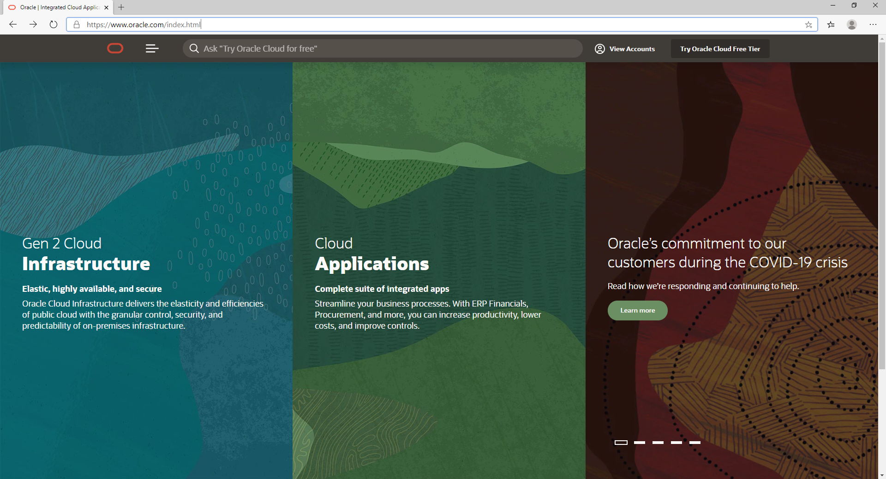
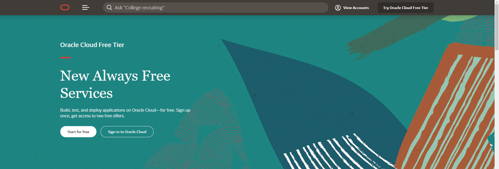
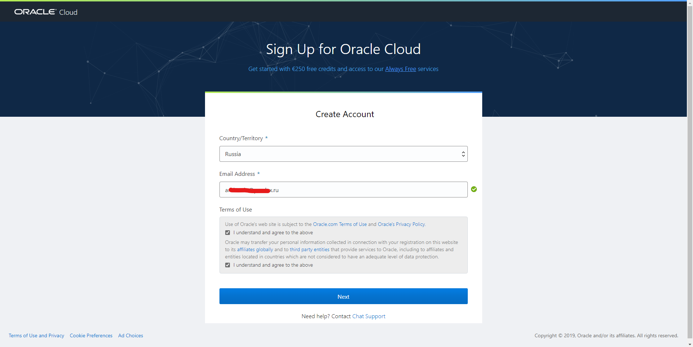
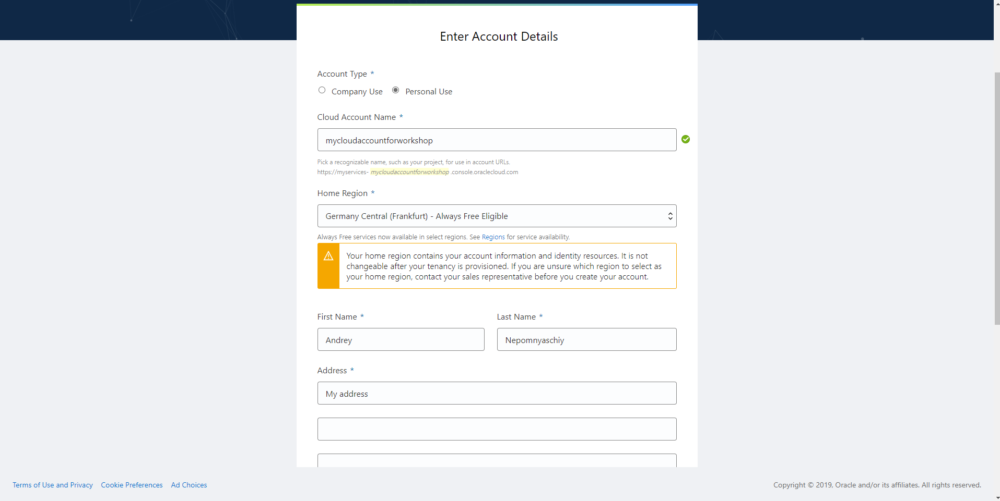
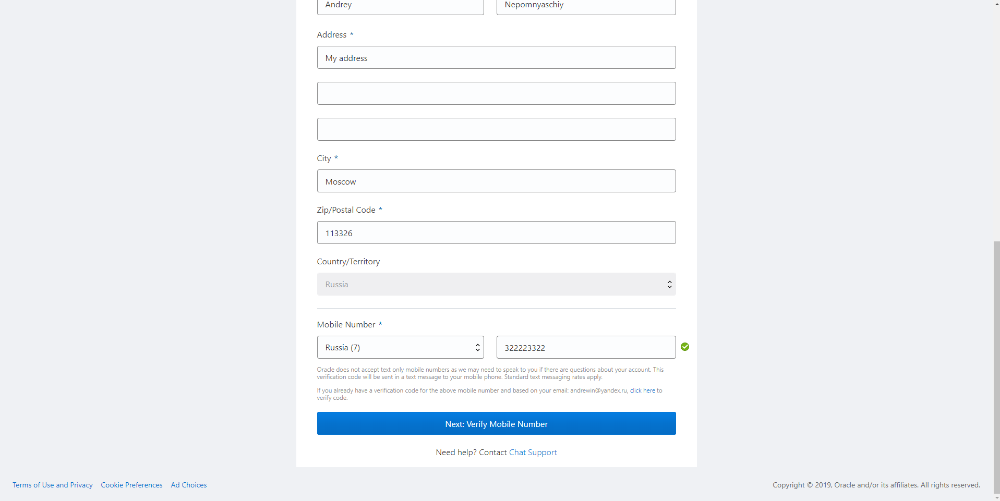
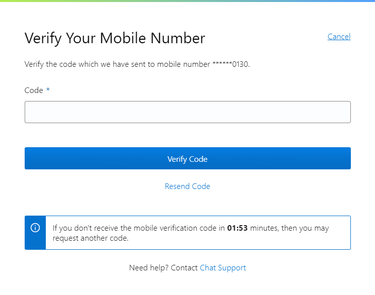
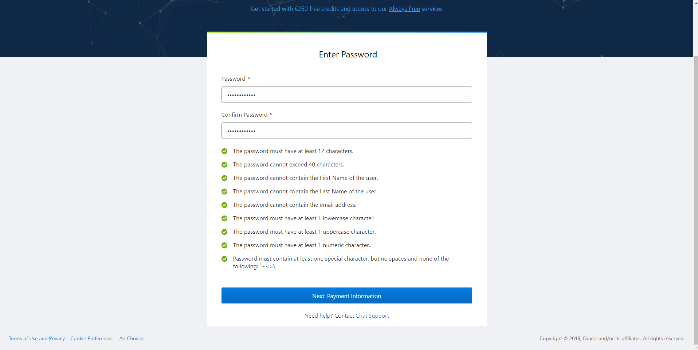
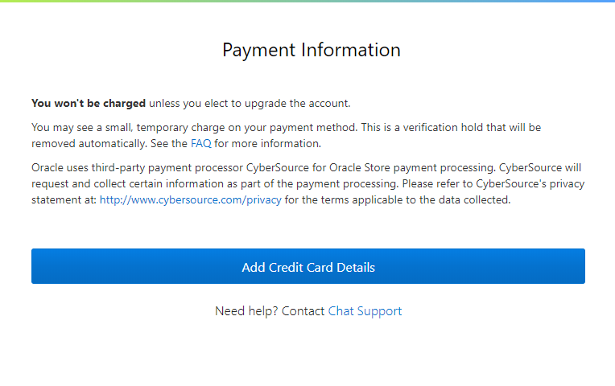

# Subscribing to Oracle Cloud Free Trial

Open Oracle Website: https://www.oracle.com/

Press **Try Oracle Cloud Free Tier**

Press **Start for Free**

Select your country, enter your email address and check your agreement with terms and conditions, then press **Next**.

**If you have registered to Oracle online event which provides special access to Free Trial, please use the same email address as you have used with the event registration.**

Enter following information:

* Account name, or Tenancy Name (which will identify your cloud account).
* Home region (or home datacenter). 
  Full list of datacenters: https://www.oracle.com/cloud/data-regions.html 
  You can choose your home region only once for trial account and can't change it later. 
* Some regions are **Always Free Eligible**  which means you can use some resources for free even after your trial expires. More details on **Always Free** resources: https://docs.cloud.oracle.com/en-us/iaas/Content/FreeTier/freetier.htm Resources availability also depends on current datacenter load.
* Your name and address (including postal index).

* Mobile phone number which will be verified via SMS.

Press **Next: Verify Mobile Number**.

You will receive SMS with verification code. Enter the code and press **Verify Code**.

If you didn't receive your code in few minutes, you can resend it or try to use different mobile number.

After mobile phone verification enter your account password. Please pay attention to password requirements.

Then press **Next**.

**If you are registering your account using the same email which you have used to register to Oracle event, and you didn't use this email before for Oracle Cloud free trial, you will not need to enter your credit card details for account verification.**

Payment information is used for verification only. **You will not be charged for cloud services unless you switch to paid account by yourself.**

After payment verification you will receive an email with your account details.

You can use free Oracle Cloud services in the amount of 300 USD (or 250 Euro) during 30 days (or less if you spend free credits earlier).