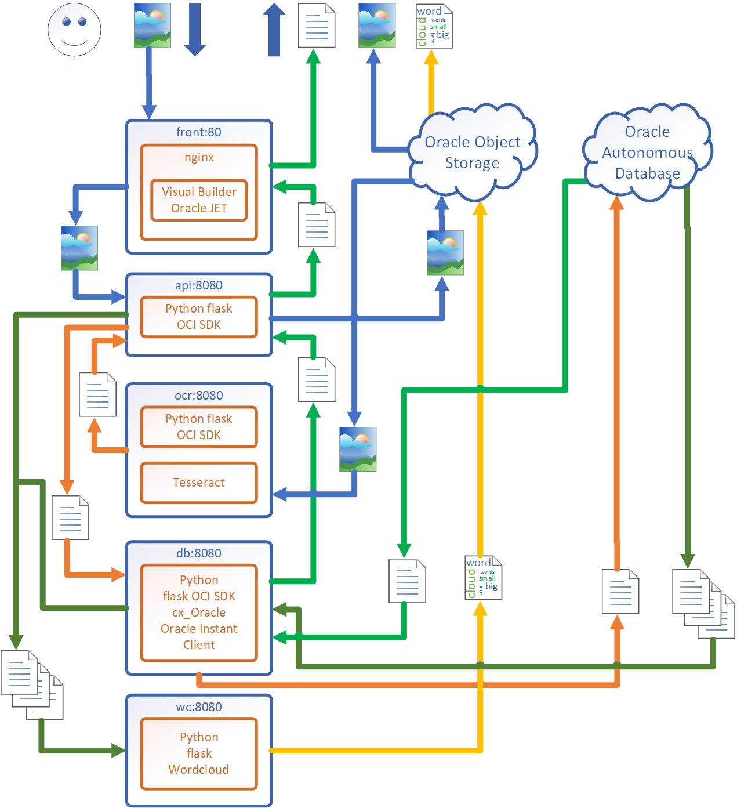

### [Contents](../../README.md)
### [Next: 2. Preparation: OCI CLI](p2.md)

# 1. Introduction

### Thanks for joining our lab!

You may ask questions on lab as well as Oracle Cloud Services to **Andrey Nepomnyaschiy**, Senior Solution Engineer at Oracle Digital.

## 1.1. Goal

During the lab you will learn how to work on Oracle Cloud Infrastructure, Autonomous Database and Oracle services for developers: Docker registry and Kubernetes clusters.

You will learn to deploy scalable and resilient applications in Kubernetes clusters, build backup infrastructure in a cloud and improve the reliability of your applications. Container experience will help you to speed up application launch, integration and deployment.

We will use **Oracle Visual Builder** and **Python** developed sample application with **cx\_Oracle** components to access Oracle database and open source **Tesseract** libraries for optical character recognition.

Application can upload images (**Oracle Object Storage** is used for keeping images). After upload images are recognized with **Tesseract** and text is stored in **Oracle Autonomous Database**. After that, word cloud is generated from last 10 recognized texts with top used words and displayed together with these texts in the application.

During lab you will create all necessary cloud infrastructure including Kubernetes cluster, and microservice application will be launched in a cluster.

## 1.2. Architecture

## 1.3. About Oracle Visual Builder

Oracle Visual Builder is a visual application development tool. It works in Oracle Cloud with no installation need. It is based on JavaScript, HTML5 and Oracle JET.

Описание Oracle Visual Builder description:
https://docs.oracle.com/en/cloud/paas/app-builder-cloud/index.html

### [Next: 2. Preparation: OCI CLI](p2.md)
