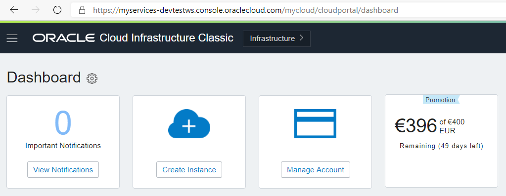
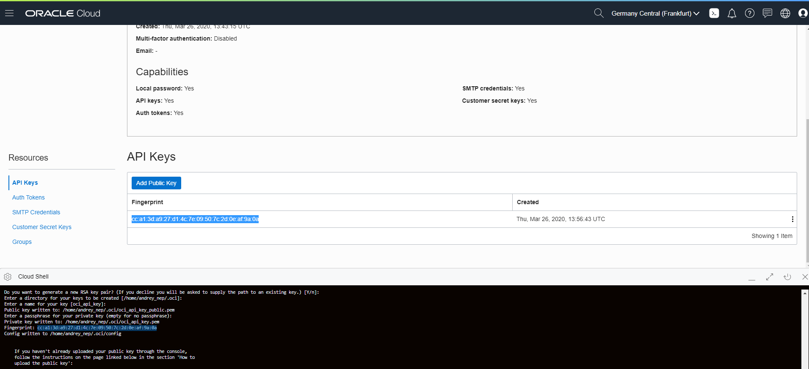

### [Содержание](../../README.md)

### [Back: 1. Introduction](p1.md) 
### [Next: 3. Preparation: Autonomous database](p3.md)

# 2. Preparation: OCI CLI

## 2.1. Before lab

You need to have basic knowledge of Linux shell and general understanding of cloud terminology.

Before starting the lab, please make sure that you have an access to Oracle Cloud (for example, active Trial), account is not locked and you have its password.

You can activate your free Trial here: https://www.oracle.com/ru/cloud/free/

When activating a Trial, you may select "home" region once. It is up to you to select any one of regions, price for resources are the same across all regions.

Different regions may have different number of Availability Domains, it might affect on number of resources which are available for the Trial (many limits are AD-specific).

List of regions: https://docs.cloud.oracle.com/en-us/iaas/Content/General/Concepts/regions.htm

Lab will be shown based on **Frankfurt** regions, which has 3 Availability Domains.

## 2.2. Access to Oracle Cloud

You can use any modern browser. We recommend to turn off all extensions that may affect browsing (such as ad blockers).


Open https://oracle.com, press **View Accounts**, and then **Sign in to Cloud** 


Enter your account name (which you have specified during account creation) and press **Next**.

Account name is also shown in the email with initial password which you have received upon account creation.


Enter your username (usually email) and password.

Oracle Cloud Dashboard will be open.

Here you can check your account balance, summary of your services and other useful information.

Press**Infrastructure** button to enter Infrastructure section. You might need to enter cloud account name once again and press **Next**.

Also you can use direct link to infrastructure console (for **Frankfurt** region): https://console.eu-frankfurt-1.oraclecloud.com/a/compute/instances


## 2.3. Cloud Shell launching

**Cloud Shell** is built-in console for working with Oracle Cloud Infrastructure. It is available directly from browser and does not require any additional software.

Cloud Shell description: <https://docs.cloud.oracle.com/en-us/iaas/Content/API/Concepts/cloudshellintro.htm>


Press **Cloud Shell** button next to the region on top menu line (upper right corner).

Cloud Shell will be launched in the same browser window. You may maximize Cloud Shell by pressing **Maximize** button.

Cloud Shell includes pre-installed OCI CLI client, docker, kubectl, sqlplus, terraform, ansible and other useful software.

Cloud Shell has access to Internet, however you can't connect to Cloud Shell console by ssh from outside.

Superuser access is not allowed.

Home folder is persisted even if Cloud Shell is closed. Its size is limited by 5 GB. However if you don't use Cloud Shell for more than 6 months, home folder might be deleted.

Other folders in Cloud Shell are ephemeral. For example, if you build Docker image, it will not persist on next launch of Cloud Shell. But whatever you save inside home folder, like Docker repository credentials, will persist.

**When using Cloud Shell, uou can access Clipboard with following keys:**

  - **Ctrl-Insert – Copy**

  - **Shift-Insert – Paste**

## 2.4. Creating user for API access

To access Oracle Cloud services from application we will use OCI CLI (Command Line Interface).

CLI Description: https://docs.cloud.oracle.com/en-us/iaas/Content/API/Concepts/cliconcepts.htm

We can use user which is already created, however it is less secure and manageable compared to creating a new user just for application access.

Scroll down main menu (lef "hamburger" button) and select **Identity / Users**


In Users menu press  **Create User**

Un user creation menu enter username: **api**, some description (API User) and press **Create**.

Select newly created user and in user details window press **Groups** on the bottom.

 

Press**Add User to Groups**

 

Select **Administrators** and press **Add**.

You can also create a user and add him to a group using OCI CLI commands::

```bash
$ oci iam user create --name api --description "API User"
$ oci iam group list
$ oci iam group add-user  --user-id <OCID of User> --group-id <OCID of Group>
```

Paste OCID of the user and Administrators group.

These are example commands. If you alreafy created a user and added him to Administrators group, you don't need to run them.

## 2.5. Creating OCI CLI configuration

Please note that OCI CLI is already configured in Cloud Shell without additional configuration. However we will create a new folder with OCI CLI configuration and credentials in order to provide access to OCI SDK to our application.

Run following command to start creating configuration:

##### [001]

```bash
$ oci setup config
```

```
This command provides a walkthrough of creating a valid CLI config file.
...
```
When asked for the folder location, press **Enter** to keep default value.

 
You will need a User OCID. To get it go to user details and copy user OCID by pressing **Copy** button.

Copy user OCID when asked by previous command.

Next you will need your Tenancy OCID.

Scroll down main menu and select **Administration / Tenancy Detals**.


In Tenancy details window copy Tenancy OCID by pressing **Copy** and paste it to Cloud Shell when asked for Tenancy OCID.

Command will ask for your region name. You can check it in upper right side.


Or you can copy it from Cloud Shell command prompt/

```bash
andrey_nep@cloudshell:~ (eu-frankfurt-1)$
```

Copy your region name  (in this example it will be`eu-frankfurt-1`, however it will differ if you have selected a different region). Paste it when requested. 

Command will prompt to generate a key for OCI CLI. Please keep path and other paramaters unchanged by pressing **Enter** several times.

```
...
Private key written to: /home/andrey_nep/.oci/oci_api_key.pem
Fingerprint: cc:a1:3d:a9:27:d1:4c:7e:09:50:7c:2d:0e:af:9a:0a
Config written to /home/andrey_nep/.oci/config


    If you haven't already uploaded your API Signing public key through the
    console, follow the instructions on the page linked below in the section
    'How to upload the public key':

        https://docs.cloud.oracle.com/Content/API/Concepts/apisigningkey.htm#How2

```

Next we will create API Key for OCI access.

Previous command has generated a public key. By default it is saved to **$HOME/.oci/oci\_api\_key\_public.pem**

Copy contents of this file after running next command::

##### [002]

```bash
$ cat $HOME/.oci/oci_api_key_public.pem
```

```
-----BEGIN PUBLIC KEY-----
MIIBIjANBgkqhkiG9w0BAQEFAAOCAQ8AMIIBCgKCAQEApwLrzvzWtmAqxCxj2KCd
...
ZQcXU+6XyUFcyfSZ9K1savuva3NEr0b9PkKtigv/WQDFSd8HsTtiN2ASebV7RAlq
SQIDAQAB
-----END PUBLIC KEY-----
```

Go to **api** user menu. Select **Identity / Users** in main menu and click on **api** username.

In user menu scroll down and click on **API Keys**.

Press **Add Public Key**


In key add window select **Paste public keys** item and paste content of your public key that you have previously copied. Then press **Add**.

If key add window is open, you can't copy key contents from Cloud Shell window. If you didn't copied it before, close key add window, select and copy key from Cloud Shell and open key add window again.

Please note that Fingerprint of entered public key must be equal to Fingerprint which was generated on previous stage.



You can check CLI by following command:

##### [003]

```bash
$ oci os ns get
```

```bash
{
  "data": "frxhexdipnsp"
}
```

It returns a json with your **namespace**, in "data" field.

You can separate namespace from json by `jq` command:

##### [004]

```bash
$ oci os ns get |jq -r ".data"
```

```bash
"frxhexdipnsp"
```

This value will be used in future in many commands. To reuse it, we will create **NAMESPACE** shell variable.

##### [005]

```bash
$ export NAMESPACE=frxhexdipnsp
```

```bash
$ echo "export NAMESPACE=frxhexdipnsp" >> $HOME/.bashrc
```

Replace **frxhexdipnsp** to your **namespace** value.

Also we need to export current region. It presents in Cloud Shell command prompt: `andrey_nep@cloudshell:~ (eu-frankfurt-1)$`

Also you can get its value via CLI:

##### [006]

```bash
$ oci iam region-subscription list |jq -r '.data[]."region-name"'
```

```bash
eu-frankfurt-1
```

Export it to **REGION** variable:

##### [007]

```bash
$ export REGION=eu-frankfurt-1
```

```bash
$ echo "export REGION=eu-frankfurt-1" >> $HOME/.bashrc
```

Replace **eu-frankfurt-1**  to your region value.

Or you can do it via CLI:

##### [008]

```bash
$ export REGION=`oci iam region-subscription list |jq -r '.data[]."region-name"'`
```

```bash
$ echo "export REGION=`oci iam region-subscription list |jq -r '.data[]."region-name"'`" >> ~$HOME.bashrc
```

Check values of **NAMESPACE** and **REGION**:

##### [009]

```bash
$ echo $NAMESPACE && echo $REGION
```

```
frxhexdipnsp
eu-frankfurt-1
```

OCI CLI configuration and keys are saved it **$HOME/.oci** folder.

We need to change path in **$HOME/.oci/config** file, which will be used later in application container.

Run following command:

##### [010]

```bash
$ sed -ie 's#^key_file.*#key_file=/home/opc/.oci/oci_api_key.pem#' $HOME/.oci/config
```
### [Back: 1. Introduction](p1.md) 
### [Далее: 3. Next: Preparation: Autonomous database](p3.md)

