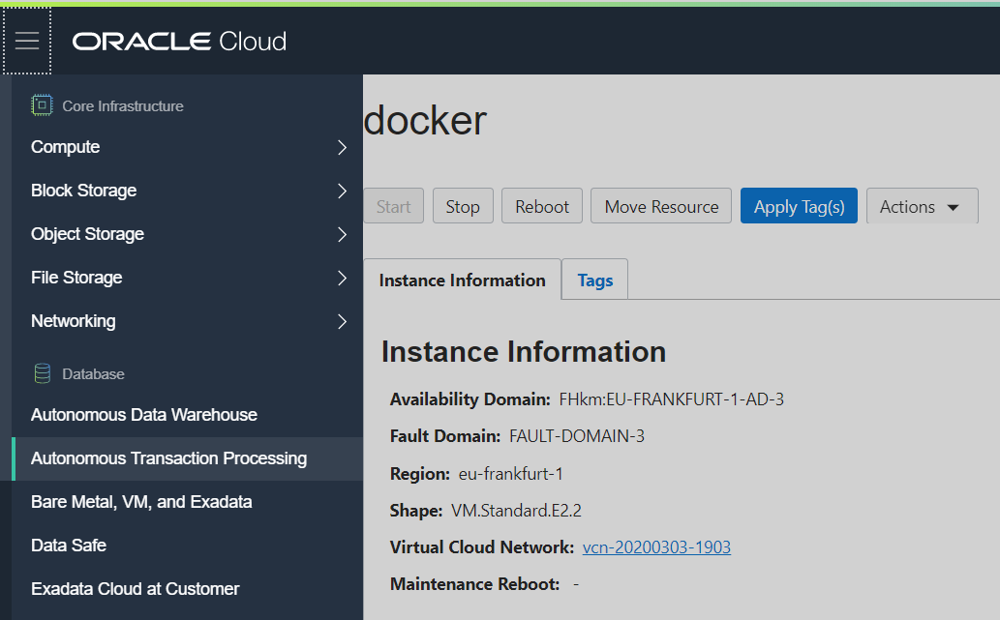
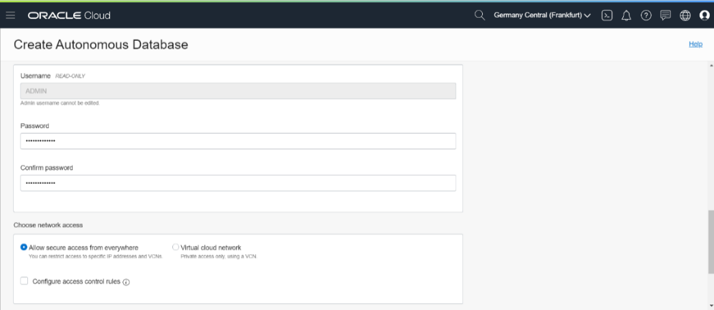
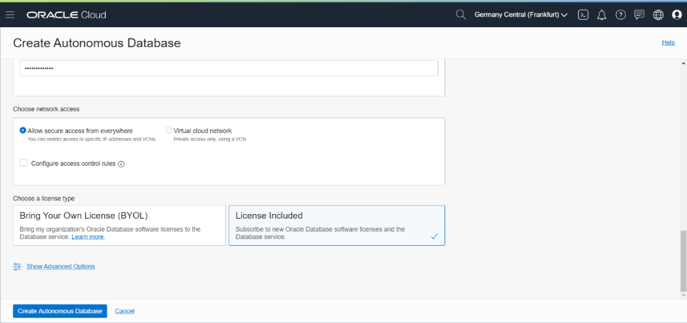
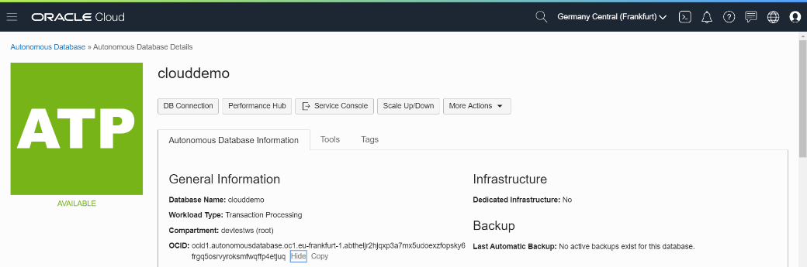
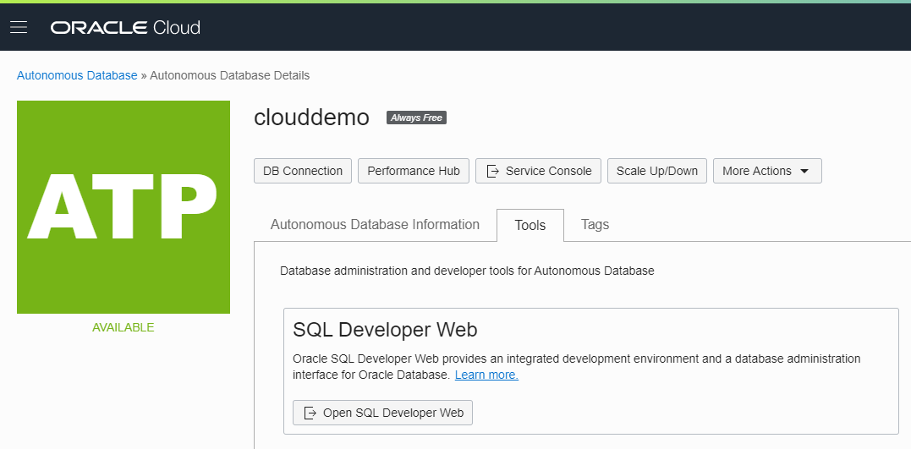
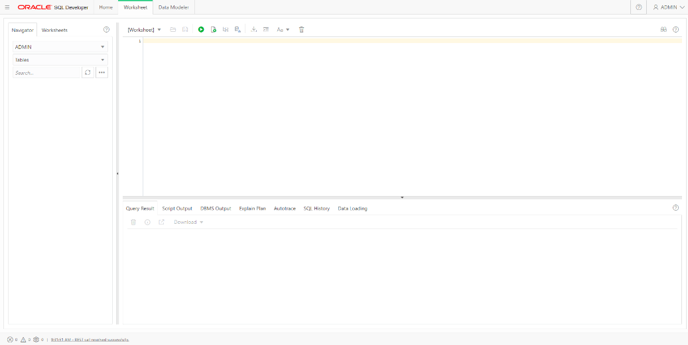

### [Index](index.md)

### [Back: 2. Preparation: OCI CLI](p2.md)

### [Next: 4. Infrastructure preparation](p4.md)

# 3. Preparation: Autonomous database

## 3.1. Creating Autonomous database

Autonomous Database description: <https://docs.cloud.oracle.com/en-us/iaas/Content/Database/Concepts/adboverview.htm>

We will create autonomous database to place there recoginized text and statistics.



Select **Autonomous Transaction Processing** and press **Create Autonomous Database**.


Enter database name. We recommend to use **clouddemo** as the database name, and Display name: **clouddemo**, because this database name is used in further scripts.

Make sure that Workload type is **Transaction Processing**.


Scroll down and enter database parameters.

It is enough to set 1 OCPU (core) and 1 TB storage for the lab.

If you are using Free Trial, you can choose **Always Free** database by pressing correspondent switch. In this case you will be limited to 1 OCPU and 20 GB of storage, it will be enough for the lab.

Auto scaling is not required for the lab.



Enter a password you want for **Admin** of the database. Make sure that you keep this password in a safe place because we will need it later.

You may keep all networking parameters unchanged.



Please make sure that license type is set to **License Included**.

Press **Create Autonomous Database**. It usually takes 1-2 minutes to create a database.

## 3.2. Getting credentials for secure access to the database



Open Autonomous Database Details and copy OCID of the database by pressing **Copy**.

Before you continue, please make sure that the database is created and in **Available** state..

In Cloud Shell execute next command (paste OCID of autonomous database that you have copied after **--autonomous-database-id**).

##### [011]

```bash
$ mkdir workshop && cd workshop
```

```bash
$ oci db autonomous-database generate-wallet --file wallet.zip --password mypassword1 --generate-type SINGLE --autonomous-database-id <paste ADB OCID here> 
```

```
Downloading file
[####################################]
100%
```

```bash
$ ls
```

```bash
wallet.zip
```

As a result, `workshop` folder will be created, and Cloud Wallet for secure access to ADB will be generated.

## 3.3. Creating user and table in ADB

Extract **wallet.zip** to folder `.wallet`:

##### [012]

```bash
$ unzip wallet.zip -d $HOME/.wallet
```

```
Archive: wallet.zip
inflating: /home/andrey\_nep/.wallet/cwallet.sso
inflating: /home/andrey\_nep/.wallet/tnsnames.ora
inflating: /home/andrey\_nep/.wallet/readme.md
inflating: /home/andrey\_nep/.wallet/truststore.jks
inflating: /home/andrey\_nep/.wallet/ojdbc.properties
inflating: /home/andrey\_nep/.wallet/sqlnet.ora
inflating: /home/andrey\_nep/.wallet/ewallet.p12
inflating: /home/andrey\_nep/.wallet/keystore.jks
```

```bash
$ ls $HOME/.wallet
```

```
cwallet.sso ewallet.p12 keystore.jks ojdbc.properties readme.md sqlnet.ora tnsnames.ora truststore.jks
```

Now we will create `TNS\_ADMIN` variable which will point to `.wallet` folder.

##### [013]

```bash
$ export TNS_ADMIN=$HOME/.wallet
```

```bash
$ echo "export TNS_ADMIN=$HOME/.wallet" >> $HOME/.bashrc
```

Second command is necessary so that variable will persist after Cloud Shell relaunch.

Edit **sqlnet.ora** file to point to the location of `.wallet`.

##### [014]

```bash
$ sed -i 's#DIRECTORY=.*#DIRECTORY="$TNS_ADMIN")))#' $HOME/.wallet/sqlnet.ora
```

Check that file has been edited successfully.

##### [015]

```bash
$ cat $HOME/.wallet/sqlnet.ora
```

```
WALLET_LOCATION = (SOURCE = (METHOD = file) (METHOD_DATA = (DIRECTORY="$TNS_ADMIN")))
SSL_SERVER_DN_MATCH=yes
```

Launch **sqlplus** to connect to database **clouddemo** as administrator user (**admin**). 

sqlplus will use our `.wallet` folder location which is set in **TNS\_ADMIN** variable.

When asked for a psssword, enter database admin password which you have set when creating the database.

##### [016]

```bash
$ sqlplus admin@clouddemo_tp
```

```
SQL*Plus: Release 19.0.0.0.0 - Production on Thu Mar 26 08:17:47 2020
Version 19.5.0.0.0
Copyright (c) 1982, 2019, Oracle. All rights reserved.
Enter password:

Last Successful login time: Wed Mar 25 2020 15:15:32 +00:00
Connected to:
Oracle Database 18c Enterprise Edition Release 18.0.0.0.0 - Production
Version 18.4.0.0.0

SQL>
```

Execute following commands in sqlplus:

##### [017]

```sql
SQL> create user demo identified by myWSPassword_01;
```

```
User created.
```

```sql
SQL> grant create session, resource to demo;
```

```
Grant succeeded.
```

```sql
SQL> grant unlimited tablespace to demo;
```

```
Grant succeeded.
```

Here we are creating a new user **demo** and granting him necessary privileges.

Replace **myWSPassword\_01** to your desired password for **demo** user.

The password must contain English uppercase and lowercase letters, at least one number and a special character.

Change scheme to **demo**. 

**Important!** All further database access, including access from the application, is performed from **demo** user, in **demo** scheme.

##### [018]

```sql
SQL> alter session set current_schema = demo;
```

```
Session altered.
```

Run following command to create a table:

##### [019]

```sql
SQL> CREATE TABLE "DEMO"."OCR"
("ID" NUMBER GENERATED BY DEFAULT ON NULL AS IDENTITY,
 "HOSTNAME" VARCHAR2(127 BYTE),
 "FILENAME" VARCHAR2(255 BYTE),
 "STARTTIME" DATE,
 "ENDTIME" DATE,
 "DURATION" NUMBER(7,2),
 "FINISHED" NUMBER(2,0),
 "TEXT" VARCHAR2(32000 BYTE),
 "TOKEN" VARCHAR2(64 BYTE),
 "LINK" VARCHAR2(1024 BYTE),
 "IPADDR" VARCHAR2(256 BYTE),
 "USERAGENT" VARCHAR2(256 BYTE));
```

```
  2    3    4    5    6    7    8    9   10   11   12   13   14  
Table created.
```

Exit from sqlplus:

##### [020]

```sql
SQL> quit
```

As an alternative to sqlplus you can use **SQL Developer** or **SQL Developer Web**:

In database details select **Tools**  and press **Open SQL Developer Web**.

Log in as **admin**.



In **SQL Developer Web** window you need to run same commands as listed above for sqlplus. If you alreadu run them with sqlplus, don't run them again in SQL Developer.

### [Back: 2. Preparation: OCI CLI](p2.md)

### [Next: 4. Infrastructure preparation](p4.md)
