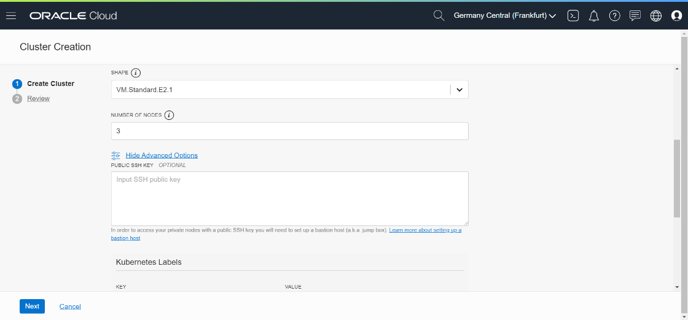

### [Contents](../../README.md)

### [Back: 3. Preparation: Autonomous database](p3.md)
### [Next: 5. Application launch](p5.md)
# 4. Infrastructure preparation

## 4.1. Creating Kubernetes cluster

OKE Service Description: https://docs.cloud.oracle.com/en-us/iaas/Content/ContEng/Concepts/contengoverview.htm

Creation of cluster usually takes 5-7 minutes. We will launch it and then move to next steps.


Select **Developer Services** / **Container Clusters (OKE)**

In cluster management window select **Create Cluster**.


Select **Quick Create** and press **Launch Workflow**.


Select cluster paramaters:

Name (for example, **clouddemo**).

Kubernetes version: latest.

Visibility: **Private** to make cluster nodes unavailable from public Internet.



Scroll down and select worker nodes VM configuration.

**VM.Standard.E2.1** or **VM.Standard.2.1** configurations are recommended.

Number of nodes: **3**

Press **Show Advanced Options** and paste your public ssh key (if you will need to access worker nodes via ssh). This step is optional; moreover, your nodes will not have public IP address.

You can leave other options unchanged.

Press **Next** to launch cluster creation.

In OKE service you are creating worker nodes only. Redundant master nodes are managed by Oracle.

When cluster will be created, you can connect to the cluster.

## 4.2. Creating a token to connect to Docker registry

OCIR (Docker Registry) service description: <https://docs.cloud.oracle.com/en-us/iaas/Content/Registry/Concepts/registryoverview.htm>

Run following command to generate token:

##### [021]

```bash
$ oci iam auth-token create --description workshop --user-id <paste User OCID here> |jq ".data.token"
```

Paste OCID  of **api** user.

As a result, auth token will be generated and displayed as an output. You can copy the token and use it as a password to connect to Docker registry.

Optionally you can generate a token in Cloud Console. If you did it with command above, you don't need to do it one more time via console.

Select **api** user menu (**Identity / Users**, then press on **api** user).

Scroll down and select **Auth Tokens**

Press **Generate Token** and enter token name.


Press **Generate Token**.

Token will be generated.


This window with token will be displayed only one time. Copy token and store it, for example, in text editor for future use. If you closed the window and didn't store your token, you may delete the token and generate a new one.

## 4.3. Connecting to Docker registry

Run following command:

##### [022]

```bash
$ docker login $REGION.ocir.io -u $NAMESPACE/api -p "<Paste Your Token Here>"
```

```
WARNING! Using --password via the CLI is insecure. Use --password-stdin.
WARNING! Your password will be stored unencrypted in /home/andrey_nep/.docker/config.json.
Configure a credential helper to remove this warning. See
https://docs.docker.com/engine/reference/commandline/login/#credentials-store

Login Succeeded
```

As a password paste the token that you have generated previously. The password must be enclosed in quotation marks, as it may contain special characters.

Please make sure that the result is: `Login Succeeded` before proceeding to next step.

## 4.4. Cloning the application

**clouddemo-micro** application is stored on **github**. Run the following command to clone it:

##### [023]

```bash
$ git clone https://github.com/andreynepo/clouddemo-micro.git
```

Change to clouddemo-micro folder.

```bash
$ cd clouddemo-micro
```

## 4.5. Building Docker images

Run following commands:

##### [025]

```bash
$ docker build -t $REGION.ocir.io/$NAMESPACE/clouddemo-micro/front $HOME/workshop/clouddemo-micro/clouddemo-front/docker/
```

```bash
$ docker build -t $REGION.ocir.io/$NAMESPACE/clouddemo-micro/api $HOME/workshop/clouddemo-micro/clouddemo-api/docker/
```

```bash
$ docker build -t $REGION.ocir.io/$NAMESPACE/clouddemo-micro/db $HOME/workshop/clouddemo-micro/clouddemo-db/docker/
```

```bash
$ docker build -t $REGION.ocir.io/$NAMESPACE/clouddemo-micro/wc $HOME/workshop/clouddemo-micro/clouddemo-wc/docker/
```

Or all 4 at once:

```bash
$ docker build -t $REGION.ocir.io/$NAMESPACE/clouddemo-micro/front $HOME/workshop/clouddemo-micro/clouddemo-front/docker/ && docker build -t $REGION.ocir.io/$NAMESPACE/clouddemo-micro/api $HOME/workshop/clouddemo-micro/clouddemo-api/docker/ && docker build -t $REGION.ocir.io/$NAMESPACE/clouddemo-micro/db $HOME/workshop/clouddemo-micro/clouddemo-db/docker/ && docker build -t $REGION.ocir.io/$NAMESPACE/clouddemo-micro/wc $HOME/workshop/clouddemo-micro/clouddemo-wc/docker/
```

4 images must be generated without error. You can see images by running following command:

##### [026]

```bash
$ docker images
```

```
REPOSITORY                                                  TAG                 IMAGE ID            CREATED              SIZE
eu-frankfurt-1.ocir.io/frxhexdipnsp/clouddemo-micro/wc      latest              e4e33db2734a        About a minute ago   307MB
eu-frankfurt-1.ocir.io/frxhexdipnsp/clouddemo-micro/db      latest              5d5e3e68ef99        2 minutes ago        330MB
eu-frankfurt-1.ocir.io/frxhexdipnsp/clouddemo-micro/api     latest              9e0ce5409f3d        2 minutes ago        353MB
eu-frankfurt-1.ocir.io/frxhexdipnsp/clouddemo-micro/front   latest              8080589f8166        4 minutes ago        95MB
python                                                      3.7-slim            74ac77e9873a        38 hours ago         179MB
debian                                                      buster-slim         8e022c70c28b        2 days ago           69.2MB
```

## 4.6. Uploading images to Docker registry

Run following commands:

##### [027]

```bash
$ docker push $REGION.ocir.io/$NAMESPACE/clouddemo-micro/front
```

```bash
$ docker push $REGION.ocir.io/$NAMESPACE/clouddemo-micro/api
```

```bash
$ docker push $REGION.ocir.io/$NAMESPACE/clouddemo-micro/db
```

```bash
$ docker push $REGION.ocir.io/$NAMESPACE/clouddemo-micro/wc
```

Or all 4 at once:

```bash
$ docker push $REGION.ocir.io/$NAMESPACE/clouddemo-micro/front && docker push $REGION.ocir.io/$NAMESPACE/clouddemo-micro/api && docker push $REGION.ocir.io/$NAMESPACE/clouddemo-micro/db && docker push $REGION.ocir.io/$NAMESPACE/clouddemo-micro/wc
```


You can view uploaded images  in **Developer Services / Registry (OCIR)**.

Please make sure that all 4 images was uploaded successfully.

### [Back: 3. Preparation: Autonomous database](p3.md)

### [Next: 5. Application launch](p5.md)