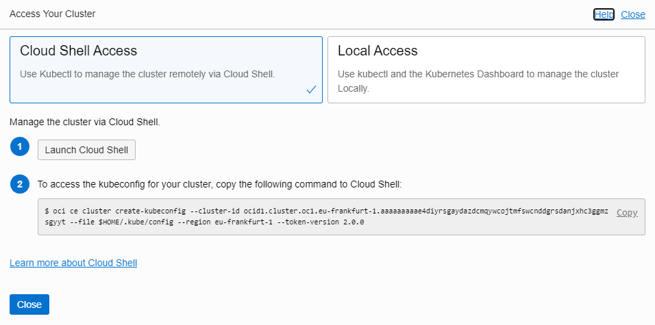
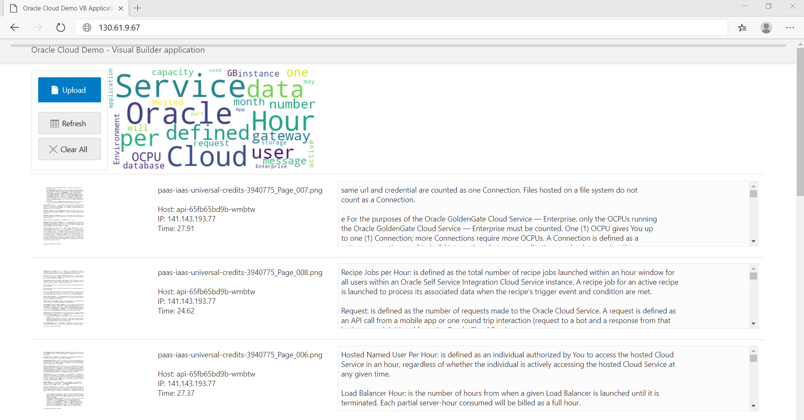

### [Index](index.md)

### [Back: 4. Infrastructure preparation](p4.md)
### [Next: 6. Working with Kubernetes cluster](p6.md)

# 5. Launching application

## 5.1. Connecting to Kubernetes cluster

Go to Kubernetes cluster details: **Developer Services / Container Clusters (OKE)** and click on your cluster.

Make sure that your Cluster Status is in Active state (in this case **Access Cluster** button will be available).

Press **Access Cluster** and follow instructions.



Copy and run command from Access Your Cluster window.

##### [028]

```bash
$ oci ce cluster create-kubeconfig --cluster-id <Paste Cluster OCID Here> --file
$HOME/.kube/config --region eu-frankfurt-1 --token-version 2.0.0
```

```
New config written to the Kubeconfig file /home/andrey_nep/.kube/config
```

If you have copied a command from Access Your Cluster window, you don't need to change it.


## 5.2. Connecting Kubernetes cluster to Docker registry

Run command:

##### [029]

```bash
$ kubectl create secret generic docker-wallet --from-file=.dockerconfigjson=$HOME/.docker/config.json --type=kubernetes.io/dockerconfigjson
```

```
secret/docker-wallet created
```

This command creates a Kubernetes secret which will be used to access Docker registry from Kubernetes cluster. It uses Docker credentials which was generated by `docker login` .

## 5.3. Creating secrets for database and object storage access

Run following commands:

##### [030]

```bash
$ kubectl create secret generic db-wallet --from-file=$HOME/.wallet
```

```
secret/db-wallet created
```

```bash
$ kubectl create secret generic oci-wallet --from-file=$HOME/.oci
```

```
secret/oci-wallet created
```

## !!! FOR SE Only: remember to adjust connection name to your value. For example: `clouddemoane_tp`

```bash
$ kubectl create secret generic db-secret --from-literal=username=demo --from-literal=password=myWSPassword_01 --from-literal=connection=clouddemo_tp
```

```
secret/db-secret created
```

If necessary, replace username, password and connection name to your values.

You can check the result by following commands:

##### [031]

```bash
$ kubectl get secrets
```

```
NAME                  TYPE                                  DATA   AGE
db-secret             Opaque                                3      110s
db-wallet             Opaque                                8      14m
default-token-txzzp   kubernetes.io/service-account-token   3      42m
docker-wallet         kubernetes.io/dockerconfigjson        1      12m
oci-wallet            Opaque                                4      9m11s
```

```bash
$ kubectl describe secret db-wallet
```

```bash
$ kubectl describe secret oci-wallet
```

Using created secrets we can use all necessary credentials in Kubernetes cluster not putting them to Docker images. This will improve our deployment security. Also we don't need to rebuild Docker images each time we change any of the credentials.  

## 5.4. Preparing cluster configuration 

Kubernetes deployment does not support using variables in image names at the moment. Therefore we need to substitute values of `NAMESPACE` and  `REGION` in deployment files. Run following commands:

##### [032]

```bash
$ find $HOME/workshop/clouddemo-micro/kube -type f -name "*.yaml" -exec sed -i "s#{{NAMESPACE}}#$NAMESPACE#g" {} +
```

```bash
$ find $HOME/workshop/clouddemo-micro/kube -type f -name "*.yaml" -exec sed -i "s#{{REGION}}#$REGION#g" {} +
```

Look at the`clouddemo-micro.yaml` file. It should not contain strings like`{{NAMESPACE}}` и `{{REGION}}`. They should be replaced by actual `NAMESPACE` and  `REGION` values.

##### [033]

```bash
$ cat kube/clouddemo-micro.yaml
```

## 5.5. Launching networking services in Kubernetes cluster

Prior to deploying payload pods to the cluster, we need to create networking services including Load Balancer which also provides Public IP access to the cluster pods.

Run following commands:

##### [034]

```bash
$ kubectl apply -f $HOME/workshop/clouddemo-micro/kube/clouddemo-micro-lb.yaml
```

```
service/front created
service/api created
service/db created
service/wc created
```

Check that all networking services are working:

##### [035]

```bash
$ kubectl get service -o wide
```

```
NAME         TYPE           CLUSTER-IP      EXTERNAL-IP   PORT(S)          AGE     SELECTOR
api          NodePort       10.96.19.163    <none>        8080:30919/TCP   9m50s   app=api
db           NodePort       10.96.18.105    <none>        8080:31233/TCP   9m50s   app=db
front        LoadBalancer   10.96.177.69    130.61.9.67   80:32384/TCP     9m50s   app=front
kubernetes   ClusterIP      10.96.0.1       <none>        443/TCP          62m     <none>
wc           NodePort       10.96.153.105   <none>        8080:31778/TCP   9m50s   app=wc
```

Please note the external (public) IP address of Load Balancer. If it is in `<pending>` state, it means that creation of Load Balancer is not finished. In this case wait few more time and repeat the latter command. As soon as Load Balancer will be ready, its IP address appears in `EXTERNAL-IP` field.

You can check Load Balancer state in **Networking / Load Balancers**.

## 5.6. Launching pods with payload

Run following commands.

##### [036]

```bash
$ kubectl apply -f $HOME/workshop/clouddemo-micro/kube/clouddemo-micro.yaml
```

```
deployment.apps/api created
deployment.apps/front created
deployment.apps/db created
deployment.apps/wc created
```

Check that all pods has been created. One of the api pods is in `Pending` state. This is because we have applied AntiAffinity rules in our deployment.

##### [037]

```bash
$ kubectl get pods -o wide
```

```
NAME                    READY   STATUS    RESTARTS   AGE     IP           NODE        NOMINATED NODE   READINESS GATES
api-7679c7fb4b-hp6lf    1/1     Running   0          26s     10.244.2.6   10.0.10.3   <none>           <none>
api-7679c7fb4b-kz25v    0/1     Pending   0          26s     <none>       <none>      <none>           <none>
api-7679c7fb4b-vw69q    1/1     Running   0          26s     10.244.0.8   10.0.10.2   <none>           <none>
api-7679c7fb4b-wqjjp    1/1     Running   0          26s     10.244.1.7   10.0.10.4   <none>           <none>
db-579b47b499-mzhk6     1/1     Running   0          26s     10.244.0.9   10.0.10.2   <none>           <none>
db-579b47b499-vjwj8     1/1     Running   0          26s     10.244.2.7   10.0.10.3   <none>           <none>
front-948cdff6d-8rnpr   1/1     Running   0          8m20s   10.244.0.5   10.0.10.2   <none>           <none>
front-948cdff6d-fn9xz   1/1     Running   0          8m20s   10.244.1.4   10.0.10.4   <none>           <none>
wc-59577c8b5f-6dxdf     1/1     Running   0          8m20s   10.244.1.6   10.0.10.4   <none>           <none>
wc-59577c8b5f-d5mv8     1/1     Running   0          8m20s   10.244.2.5   10.0.10.3   <none>           <none>

```

Now you can access to the application using Load Balancer IP address.

##### [038]

```bash
$ kubectl get service front
```

```
NAME         TYPE           CLUSTER-IP      EXTERNAL-IP     PORT(S)        AGE
front        LoadBalancer   10.96.108.46    130.61.9.67     80:32447/TCP   3d18h
```



### [Back: 4. Infrastructure preparation](p4.md)

### [Next: 6. Working with Kubernetes cluster](p6.md)

