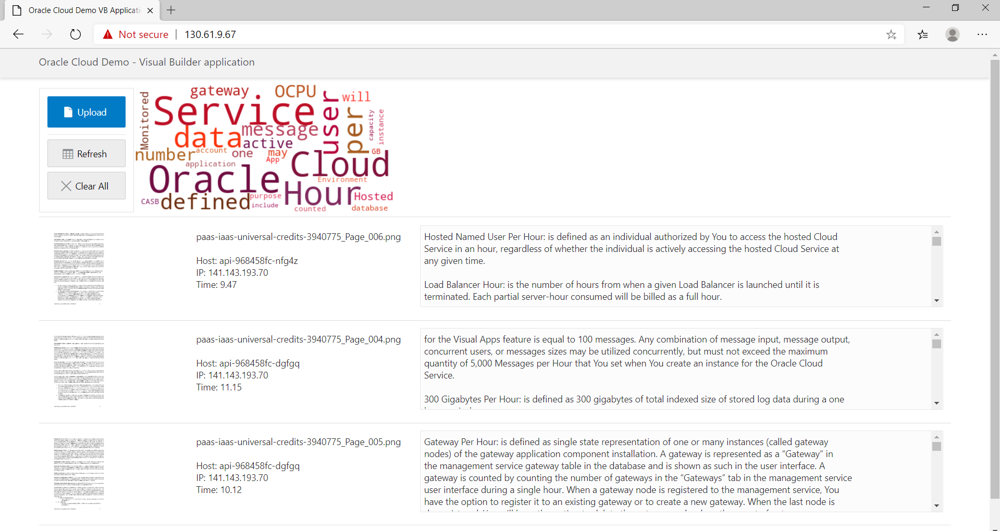
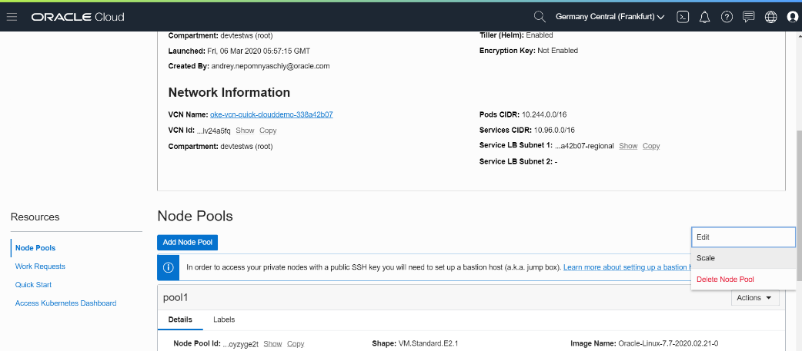

### [Contents](../../README.md)

### [Back: 5. Application launch](p5.md)
### [Next: 7. Finalizing and cleaning up](p7.md)
# 6. Working with Kubernetes cluster

## 6.1. Example of quick pod update

Now word cloud is generated using standard green-blue color theme.

We can change theme to illustrate quick microservices deployment concept.

Label Docker image **wc** with version number and color:

##### [039]

```bash
$ docker tag $REGION.ocir.io/$NAMESPACE/clouddemo-micro/wc:latest $REGION.ocir.io/$NAMESPACE/clouddemo-micro/wc:1.0-green
```

Edit Python file which is responsible for word cloud generation.

##### [040]

```bash
$ nano $HOME/workshop/clouddemo-micro/clouddemo-wc/docker/context/app/wc.py
```

Scroll down to **def genwordcloud (fulltext):** line.

Uncomment following line deleting `#` symbol:

```
#        wordcloud.recolor (color_func=color_func, random_state=3)
```

This command is calling recolor function.

Save file when exiting nano by pressing **Ctrl+X**, then **Y** and **Enter**).

Run following commands:

##### [041]

```bash
$ docker build -t $REGION.ocir.io/$NAMESPACE/clouddemo-micro/wc:1.0-red $HOME/workshop/clouddemo-micro/clouddemo-wc/docker/
```

```
Sending build context to Docker daemon   5.12kB
Step 1/10 : FROM python:3.7-slim
...
Successfully built 90083ee72432
Successfully tagged eu-frankfurt-1.ocir.io/frxhexdipnsp/clouddemo-micro/wc:1.0-red
```

You can see images list:

##### [042]

```bash
$ docker images
```

```
REPOSITORY                                                  TAG                 IMAGE ID            CREATED             SIZE
eu-frankfurt-1.ocir.io/frxhexdipnsp/clouddemo-micro/wc      1.0-red             7412658ae053        13 seconds ago      307MB
eu-frankfurt-1.ocir.io/frxhexdipnsp/clouddemo-micro/wc      1.0-green           2b31b55ce779        12 minutes ago      307MB
eu-frankfurt-1.ocir.io/frxhexdipnsp/clouddemo-micro/wc      latest              2b31b55ce779        12 minutes ago      307MB
eu-frankfurt-1.ocir.io/frxhexdipnsp/clouddemo-micro/db      latest              fed92ce41a83        12 minutes ago      330MB
eu-frankfurt-1.ocir.io/frxhexdipnsp/clouddemo-micro/api     latest              a23bbeeda841        13 minutes ago      353MB
eu-frankfurt-1.ocir.io/frxhexdipnsp/clouddemo-micro/front   latest              7fc8a7544bcc        15 minutes ago      95MB
python                                                      3.7-slim            74ac77e9873a        2 days ago          179MB
debian                                                      buster-slim         8e022c70c28b        3 days ago          69.2MB
```

Run following commands:

##### [043]

```bash
$ docker push $REGION.ocir.io/$NAMESPACE/clouddemo-micro/wc
```

```
The push refers to repository [eu-frankfurt-1.ocir.io/frxhexdipnsp/clouddemo-micro-wc]
9130414ff7f5: Pushed
...
```

```bash
$ kubectl set image deployment/wc wc=$REGION.ocir.io/$NAMESPACE/clouddemo-micro/wc:1.0-red --record
```

```
deployment.extensions/wc image updated
```

After some time image will be downloaded and new version of pods will be launched using rolling update.

##### [044]

```bash
$ kubectl get pods
```

```
NAME                     READY   STATUS        RESTARTS   AGE
api-7679c7fb4b-c5z2s     1/1     Running       1          13h
api-7679c7fb4b-kz25v     1/1     Running       0          14h
api-7679c7fb4b-nzdgz     1/1     Running       0          13h
api-7679c7fb4b-tgrtf     0/1     Pending       0          13h
db-579b47b499-88q6h      1/1     Running       0          13h
db-579b47b499-8drqx      1/1     Running       0          13h
front-7545444c66-6q59l   1/1     Running       0          13h
front-7545444c66-ttv2r   1/1     Running       0          13h
wc-59577c8b5f-pwtgw      1/1     Terminating   0          13h
wc-59577c8b5f-wpxbn      1/1     Terminating   0          13h
wc-8449dc49b5-cksfr      1/1     Running       0          16s
wc-8449dc49b5-t2m6n      1/1     Running       0          24s
```

You can upload a new image in the application. After it will be processed, word cloud will be generated with new red color theme.



## 6.2. Deployment history and rollback

You can change image in the deployment using following command:

##### [045]

```bash
$ kubectl set image deployment/wc wc=$REGION.ocir.io/$NAMESPACE/clouddemo-micro/wc:1.0-green --record
```

```
deployment.extensions/wc image updated
```

Now you can check deployment history:

##### [046]

```bash
$ kubectl rollout history deployment wc
```

```
deployment.extensions/wc 
REVISION  CHANGE-CAUSE
1         <none>
2         kubectl set image deployment/wc wc=eu-frankfurt-1.ocir.io/frxhexdipnsp/clouddemo-micro/wc:1.0-red --record=true
3         kubectl set image deployment/wc wc=eu-frankfurt-1.ocir.io/frxhexdipnsp/clouddemo-micro/wc:1.0-green --record=true
```

You can see 4 revisions of the deployment: initial (1) with `latest` label which has no change-cause, (2) `1.0-red` and (3) `1.0-green`.

You can roll back to previous version by following command:

##### [047]

```bash
$ kubectl rollout undo deployment wc
```

```
deployment.extensions/wc
```

As a result, new revision will be created where last change will be rolled back.

You can roll back to any of the revisions in deployment history:

##### [048]

```bash
$ kubectl rollout history deployment wc
```

```bash
$ kubectl rollout undo deployment wc --to-revision=1
```

## 6.3. Changing secrets

Change password of **demo** user in the database.

##### [049]

```bash
$ sqlplus admin@clouddemo_tp
```

Enter database **admin** password.

Change **demo** password to a new one:

##### [050]

```sql
SQL> ALTER USER DEMO IDENTIFIED BY "myWSPassword_02";
```

```
User altered.
```


Application is still working on this stage because established database connections are still active.

We can close connections from **sqlplus** or by deleting db pods which will be recreated and establish new sessions.

If you want to do it via **sqlplus**:

##### [051]

```sql
SQL> SELECT SID, SERIAL#, STATUS FROM V$SESSION WHERE USERNAME = 'DEMO';

       SID    SERIAL# STATUS
---------- ---------- --------
      3934      22834 INACTIVE
     22250      58494 INACTIVE

SQL> ALTER SYSTEM KILL SESSION 'AAAAA, BBBBB';

System altered.

SQL> ALTER SYSTEM KILL SESSION 'CCCCC, DDDDD';

System altered.
```

You will need to put your respective values of `SID` and `SERIAL#`  instead of AAAAA, BBBBB, CCCCC, DDDDD.

Check that application can't work with database anymore.

Another option of closing database connections is to delete db pods. If you have closed connections via sqlplus, you may skip this step and go to [deleting **secret**](#####[054]).

##### [052]

```sql
SQL> quit
```

```bash
$ kubectl get pods
```

```
NAME                     READY   STATUS    RESTARTS   AGE
api-5ffc6789f8-92qdx     1/1     Running   0          16m
api-5ffc6789f8-mst6c     1/1     Running   0          16m
api-5ffc6789f8-wd8fs     1/1     Running   0          16m
api-5ffc6789f8-zfxcq     0/1     Pending   0          16m
db-5c87d77889-gcpk5      1/1     Running   0          16m
db-5c87d77889-rfxrc      1/1     Running   0          16m
front-6489674dcf-79wsv   1/1     Running   0          16m
front-6489674dcf-vhnjx   1/1     Running   0          16m
wc-9bcfc4d98-5tfxk       1/1     Running   0          16m
wc-9bcfc4d98-m75rs       1/1     Running   0          16m
```

Delete db pods:

##### [053]

```bash
$ kubectl delete pod <pod_db_1> <pod_db_2>
```

Replace `<pod_db_1>` and `<pod_db_2>` by your database pod names separated by space.

New pods will be created automatically and will not be able to connect to the database. 

You can check it in the application.

Delete **secret** by following command:

##### [054]

```bash
$ kubectl delete secret db-secret
```

Create **secret** with new password:

##### [055]

```bash
$ kubectl create secret generic db-secret --from-literal=username=demo --from-literal=password=myWSPassword_02 --from-literal=connection=clouddemo_tp
```

Now delete db pods, new pods will be created automatically with new **secret** values.

##### [056]

```bash
$ kubectl get pods
```

```
NAME                     READY   STATUS    RESTARTS   AGE
api-5ffc6789f8-92qdx     1/1     Running   0          22m
api-5ffc6789f8-mst6c     1/1     Running   0          22m
api-5ffc6789f8-wd8fs     1/1     Running   0          22m
api-5ffc6789f8-zfxcq     0/1     Pending   0          22m
db-5c87d77889-5gpk8      1/1     Running   0          91s
db-5c87d77889-zfccm      1/1     Running   0          91s
front-6489674dcf-79wsv   1/1     Running   0          22m
front-6489674dcf-vhnjx   1/1     Running   0          22m
wc-9bcfc4d98-5tfxk       1/1     Running   0          22m
wc-9bcfc4d98-m75rs       1/1     Running   0          22m
```

```bash
$ kubectl delete pod <pod_db_1> <pod_db_2>
```

Replace `<pod_db_1>` and `<pod_db_2>` by your database pod names separated by space.

New pods will be created automatically and will and will use new **secret** values, therefore they will be able to connect to the database. 

You can check it in the application.

## 6.4. Cluster scaling

Pod scaling can be done by following commands:

##### [057]

```bash
$ kubectl scale --replicas=5 deployment api
```

```bash
$ kubectl scale --replicas=1 deployment db
```

```bash
$ kubectl scale --replicas=1 deployment front
```

```bash
$ kubectl scale --replicas=1 deployment wc
```
Replace value after `--replicas=` by required pod number.

##### [058]

```bash
$ kubectl get pods -o wide
```

```
NAME                     READY   STATUS    RESTARTS   AGE     IP           NODE        NOMINATED NODE   READINESS GATES
api-5ffc6789f8-5bhkc     1/1     Running   0          7m20s   10.244.2.5   10.0.10.2   <none>           <none>
api-5ffc6789f8-5c7cg     0/1     Pending   0          81s     <none>       <none>      <none>           <none>
api-5ffc6789f8-8dsmw     1/1     Running   0          7m20s   10.244.0.4   10.0.10.4   <none>           <none>
api-5ffc6789f8-b2t5k     1/1     Running   0          7m20s   10.244.1.6   10.0.10.3   <none>           <none>
api-5ffc6789f8-ttx45     0/1     Pending   0          7m20s   <none>       <none>      <none>           <none>
db-575b76985c-rzx6w      1/1     Running   0          7m20s   10.244.1.5   10.0.10.3   <none>           <none>
front-6489674dcf-bzxnw   1/1     Running   0          7m20s   10.244.1.4   10.0.10.3   <none>           <none>
wc-6ff7c6c794-dwdgc      1/1     Running   0          2m53s   10.244.2.6   10.0.10.2   <none>           <none>
```

Worker nodes can be scaled in Node Pools menu:



Scroll down Cluster details till **Node Pools** and press **Actions / Scale**.

In Scale window enter new worker nodes quantity (for example, 4) then scroll down and press **Scale**.

Worker nodes will be created or deleted according new quantity.

If you set **Node Pool** size to 0, all worker nodes will be deleted and all pods will be de-scheduled (or re-scheduled to another Node Pool if it exists), however cluster will not be deleted.

You can also scale node pools by oci cli command:

##### [059]

```bash
$ oci ce node-pool update --size 2 --node-pool-id <Paste your Node Pool OCID Here> 
```

Paste OCID of your **Node Pool**. Enter your desired node pool size after `--size`.
### [Back: 5. Application launch](p5.md)

### [Next: 7. Finalizing and cleaning up](p7.md)