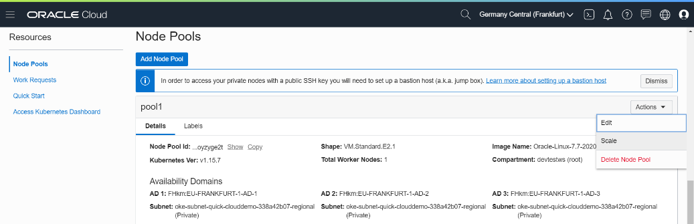
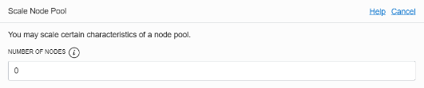

### [Index](index.md)

### [Back: 6. Working with Kubernetes cluster](p6.md)

# 7. Finalizing and Cleaning up

Here you can see main services and resources that has been created during workshop. You can stop them to avoid extra charging or delete if you don't need them anymore.

If you would like to continue working with these resources, you better stop them rather than delete.

### 7.1. Deleting pods and services
You can delete pods and services, including Load Balancer if you don't need them.

```bash
$ kubectl delete -f $HOME/workshop/clouddemo-micro/kube/clouddemo-micro.yaml
```

```bash
$ kubectl delete -f $HOME/workshop/clouddemo-micro/kube/clouddemo-micro-lb.yaml
```

This could be reverted by re-applying yaml files using **kubectl apply** However Load Balancer External IP address will be different.

### 7.2. Stopping or deleting Kubernetes cluster
 

If you want to stop cluster, scroll down to **Node Pools** and press **Actions / Scale**.



Set **Number of Nodes** to 0. Scroll down and press **Scale**.

All worker nodes will be deleted, but cluster will remain. All pods will be in Pending state.

If you will need your cluster again, you can scale your Node Pool to the number you desire. New worker nodes will be created and pods will be scheduled to new nodes.

If you don't need your cluster anymore, you can delete it. **This can't be reverted**.

When you delete a cluster, Node Pools are deleted as well with all worker nodes.


Press**Delete Cluster**. 

If you didn't delete services prior to deleting a cluster, Load Balancer will not be removed.

### 7.3. Deleting uploaded files in Object Storage

You can delete Object Storage content that has been created by the application if you don't need it anymore. **This can't be reverted**.


You can delete **Buckets** only after you delete its content. To do so you need to enter each Bucket, select all objects and delete them.

### 7.4. Stopping or deleting Autonomous Database

Yf you are not using a database, you can stop it by pressing **Stop**. If you want to use application again, you can start your database by pressing **Start**.

If you don't need your database anymore, you can terminate it by pressing **Terminate**.**This can't be reverted**.


### 7.5. Deleting Load Balancer

Go to **Networking / Load Balancers**.

Ifyou didn't delete the service by `kubectl delete ...`, you can delete your Load Balacer here.

**This can't be reverted**.

### 7.6. Deleting Virtual Cloud Network

Go to **Networking / Virtual Cloud Networks**.

You can delete your network here. It will be possible if no resources are using the network: Load Balancers, Virtual Machines, clusters and so on.

**This can't be reverted**.

### 7.7. Deleting user

Go to **Identity / Users**.

Before you can delete a user, you must remove it from all groups.

**This can't be reverted**.

### 7.8. Deleting Docker repositories

Go to **Developer Services / Registry (OCIR)**. You can delete each of the repositories.

**This can't be reverted**.

### Thanks for joining our lab!

You may ask questions on lab as well as Oracle Cloud Services to **Andrey Nepomnyaschiy**, Senior Solution Engineer at Oracle Digital.


### [Back: 6. Working with Kubernetes cluster](p6.md)