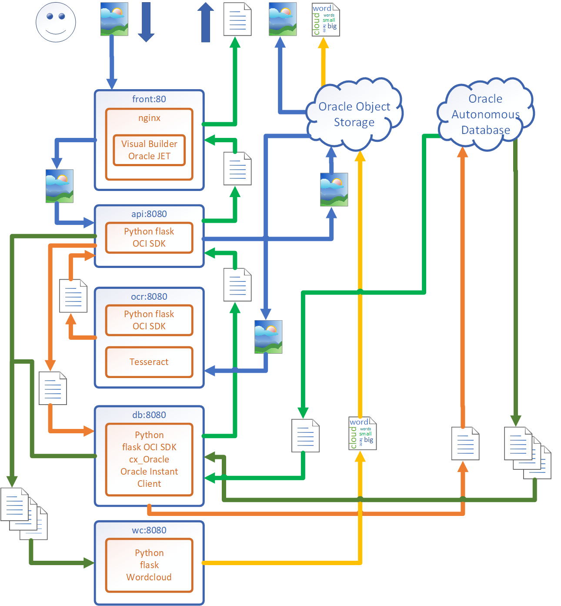

## [Назад: Содержание](../../README.md)

# Вводная часть

## Контакты

Спасибо за участие в практикуме\!

По всем вопросам, касающимся практикума, а также облачных сервисов Oracle, можете обращаться:

**Андрей Непомнящий**, старший инженер по решениям, Oracle Digital

<andrey.nepomnyaschiy@oracle.com>

## Цель практикума

Во время практикума вы получите практические навыки по работе облачной инфраструктурой Oracle, автономной транзакционной базой Oracle, а также сервисами для разработчиков: Docker репозиторием и кластерами Kubernetes.

Вы сможете развертывать отказоустойчивые масштабируемые приложения в кластерах Kubernetes, создавать резервную инфраструктуру в облаке и повысить надежность своих информационных систем. Навыки работы с контейнерами помогут вам ускорить запуск, интеграцию и развертывание своих приложений.

В качестве примера для развертывания в облачной инфраструктуре Oracle будет использовано приложение, написанное на Oracle Visual Builder (на базе Javascript компонентов Oracle Jet), и на Python с использованием компонентов cx\_Oracle для доступа к СУБД Oracle и открытых библиотек Tesseract.

Приложение позволяет загружать изображения (в качестве хранилища используется Oracle Cloud Object Storage), которые затем распознаются, а распознанный текст сохраняется в автономной базе данных Oracle. После распознавания из последних 10 распознанных файлов формируется «облако слов» с наиболее часто встречающимися в тексте словами. Эти 10 последних файлов вместе с облаком слов отображаются в приложении.

Во время практикума будет создана требуемая для запуска приложения инфраструктура в облаке Oracle, в том числе кластер Kubernetes, и микросервисное приложение будет запущено в этом кластере.

## Архитектура приложения

## Об Oracle Visual Builder

Oracle Visual Builder – средство визуальной разработки в облаке Oracle, не требующее инсталляции, основанное на JavaScript, HTML5 и наборе библиотек Oracle JET.

Описание Oracle Visual Builder:
https://docs.oracle.com/en/cloud/paas/app-builder-cloud/index.html

## [Далее: Подготовка](Oracle Kubernetes Workshop p2.md)
