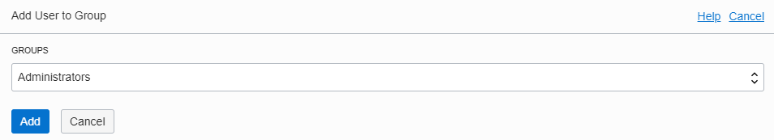
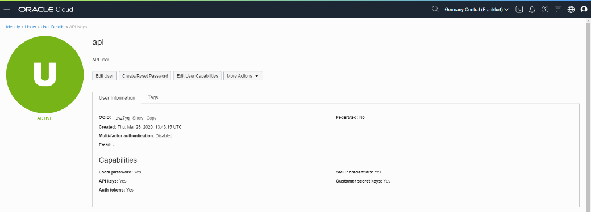

## [Назад: Вводная часть](Oracle Kubernetes Workshop p1.md)

# Подготовка

## Перед практикумом

Необходимо базовое знание командной строки Linux, понимание терминологии, используемой в облачных технологиях.

## Создание учетной записи в Oracle cloud

Прежде чем приступать к практикуму, убедитесь, что у вас имеется доступ к облаку Oracle (например, активированный Trial), учетная запись не заблокирована и пароль к ней не утрачен.

Активировать Trial можно по ссылке:
<https://www.oracle.com/ru/cloud/free/>

При активации Trial можно выбрать один «домашний» регион. При выборе региона ориентируйтесь на свои географические предпочтения. В разных регионах доступность некоторых ресурсов может отличаться, однако цены на сервисы одинаковы для всех регионов.

Список регионов:
<https://docs.cloud.oracle.com/en-us/iaas/Content/General/Concepts/regions.htm>

## Доступ к облаку Oracle

Для работы вам потребуется интернет-браузер. Рекомендуется отключить расширения браузера, влияющие на содержимое (например, блокировщики рекламы и анонимайзеры).


Зайдите на сайт oracle.com, нажмите View Accounts, а затем Sign in to Cloud (На других языках надписи будут различаться).


Введите имя аккаунта, которое было задано при создании учетной записи, и нажмите Next.

Имя аккаунта можно проверить в первоначальном письме с учетными данными Oracle Cloud.


Введите имя и пароль учетной запись Oracle Cloud.

Вы попадете на приборную панель облака Oracle.

Здесь вы можете проверить остаток средств на балансе, увидеть сводку по используемым сервисам и т.д.

Чтобы перейти в консоль управления инфраструктурой, нажмите на кнопку Infrastructure. Возможно, потребуется еще раз ввести имя аккаунта и нажать Next.

Также, если вы ранее уже открывали консоль управления инфраструктурой, можно пройти по прямой ссылке:
<https://console.eu-frankfurt-1.oraclecloud.com/a/compute/instances>


## Запуск Cloud Shell

Cloud Shell – это встроенная консоль для работы с Oracle Cloud Infrastructure. Она доступна из любого браузера и не требует установки дополнительного ПО.

Описание Cloud Shell:
<https://docs.cloud.oracle.com/en-us/iaas/Content/API/Concepts/cloudshellintro.htm>


Нажмите на кнопку запуска Cloud Shell рядом с названием региона (справа вверху).

Будет запущен Cloud Shell в том же самом окне браузера.

В состав ПО, установленного в Cloud Shell, входит клиент командной строки OCI CLI, docker, kubectl, sqlplus, terraform, ansible и ряд другого ПО.

Cloud Shell имеет доступ в Интернет, но к консоли Cloud Shell нельзя подключиться извне по ssh.

Доступ к правам суперпользователя не предоставляется.

Размер домашней папки пользователя, которая сохраняется даже при неработающем Cloud Shell, составляет 5 ГБ. Эта папка будет удалена при неиспользовании Cloud Shell более 6 месяцев.

Другие папки, за исключением домашней, являются эфемерными. Например, если собрать Docker контейнер, то он не будет доступен при следующем запуске Cloud Shell и его придется собирать заново.

**Для доступа к Clipboard в Cloud Shell используются следующие сочетания клавиш:**

  - **Ctrl-Insert – Скопировать**

  - **Shift-Insert – Вставить**

## Создание пользователя для доступа к API

Для доступа к сервисам Oracle Cloud из приложения мы будем использовать OCI CLI (Command Line Interface).

Описание CLI:
<https://docs.cloud.oracle.com/en-us/iaas/Content/API/Concepts/cliconcepts.htm>

Можно использовать уже созданного пользователя, однако более правильным будет создать нового пользователя специально для доступа из приложения.

Пролистайте главное меню вниз и выберите раздел **Identity / Users**


В меню пользователей нажмите **Create User**

В меню создания пользователя введите имя: **api**, описание пользователя (например, API User) и нажмите **Create**.

Нажмите на созданного пользователя api и в появившемся окне детальной информации о пользователе внизу нажмите **Groups**.

 **Нажмите Add User to Groups**

 В появившемся окне выберите **Administrators** и нажмите **Add**.

## Создание конфигурации OCI CLI

Обратите внимание, что OCI CLI в Cloud Shell работает изначально и без создания конфигурации. Однако создание папки с конфигурацией потребуется для того, чтобы приложение могло получить доступ к OCI SDK.

Выполните команду создания конфигурации:

```bash
$ oci setup config
```

```bash
This command provides a walkthrough of creating a valid CLI config file.
...
```

 Вам потребуется User OCID. Для его получения перейдите в детальную информацию пользователя api и скопируйте его OCID, нажав на Copy (чтобы просмотреть OCID, нажмите Show)

Вставьте значение OCID в ответ на запрос из предыдущей команды.

Далее вам потребуется OCID вашего аккаунта (Tenancy OCID).

Для его получения пролистайте боковое меню до конца, выберите пункт
Administration и далее Tenancy Details.


В разделе информации о Tenancy скопируйте OCID и вставьте его в ответ на запрос.

Далее программа установки запросит ваш регион. Введите **eu-frankfurt-1**

Программа установки предложит сгенерировать ключ для доступа к OCI CLI. Оставьте параметры и пути без изменения, нажав несколько раз Enter.

```
...
Private key written to: /home/andrey_nep/.oci/oci_api_key.pem
Fingerprint: cc:a1:3d:a9:27:d1:4c:7e:09:50:7c:2d:0e:af:9a:0a
Config written to /home/andrey_nep/.oci/config

If you haven't already uploaded your public key through the console,
follow the instructions on the page linked below in the section 'How to
upload the public key':
https://docs.cloud.oracle.com/Content/API/Concepts/apisigningkey.htm#How2
```

Далее необходимо создать API Key для доступа к OCI.

В предыдущем пункте программа установки сохранила публичный ключ. По умолчанию путь его местонахождения **$HOME/.oci/oci\_api\_key\_public.pem**

Скопируйте содержимое этого файла после выполнения команды:

```bash
$ cat $HOME/.oci/oci_api_key_public.pem
```

```
-----BEGIN PUBLIC KEY-----
MIIBIjANBgkqhkiG9w0BAQEFAAOCAQ8AMIIBCgKCAQEApwLrzvzWtmAqxCxj2KCd
...
ZQcXU+6XyUFcyfSZ9K1savuva3NEr0b9PkKtigv/WQDFSd8HsTtiN2ASebV7RAlq
SQIDAQAB
-----END PUBLIC KEY-----
```

Перейдите в меню пользователя **api**. Для этого в главном меню выберите Identity / Users и нажмите на пользователя **api**.

В меню пользователя пролистайте вниз и выберите API Keys.

Нажмите Add Public Key


В окне добавления ключа выберите пункт Paste public keys и вставьте содержимое публичного ключа и нажмите Add.

Важно\! Если окно добавления ключа открыто, вы не сможете скопировать содержимое ключа из окна Cloud Shell. Если вы не скопировали его раньше, закройте окно, выделите и скопируйте ключ и снова откройте окно добавления ключа.

Обратите внимание, что Fingerprint созданного ключа должен совпадать с Fingerprint, выданный программой установки на предыдущем этапе.


Проверить работу CLI можно командой:

```bash
$ oci os ns get
```

```bash
{
"data": "frxhexdipnsp"
}
```

Результат этой команды – json, содержащий в поле “data” название вашего **namespace** (оно будет использовано в дальнейшем).

Выделить значение namespace из json можно командой jq:

```bash
$ oci os ns get |jq ".data"
```

```bash
"frxhexdipnsp"
```

Это значение используется в дальнейшем во многих командах. Чтобы каждый раз не вводить его, создадим переменную **NAMESPACE**.

```bash
$ export NAMESPACE=frxhexdipnsp
```

```bash
$ echo "export NAMESPACE=frxhexdipnsp" >> $HOME/.bashrc
```

Замените **frxhexdipnsp** на ваше значение **namespace**.

Также необходимо сохранить значение текущего региона.

Оно присутствует в строке Cloud Shell: andrey\_nep@cloudshell:\~ (**eu-frankfurt-1**)$

Также его можно получить через CLI:

```bash
$ oci iam region-subscription list |jq -r '.data[]."region-name"'
```

```bash
eu-frankfurt-1
```

Сохраним его в переменную REGION для дальнейшего использования в
командах.

```bash
$ export REGION=eu-frankfurt-1
```

```bash
$ echo "export REGION=eu-frankfurt-1" >> $HOME/.bashrc
```

Замените **eu-frankfurt-1** на ваше значение региона.

Альтернативно это можно сделать через CLI:

```bash
$ export REGION=`oci iam region-subscription list |jq -r '.data[]."region-name"'`
```

```bash
$ echo "export REGION=`oci iam region-subscription list |jq -r '.data[]."region-name"'`" >> ~$HOME.bashrc
```

Проверьте значения переменных NAMESPACE и REGION:

```bash
$ echo $NAMESPACE
```

```
frxhexdipnsp
```

```bash
$ echo $REGION
```

```
eu-frankfurt-1
```

Конфигурация OCI CLI и ключи сохранены в папке **$HOME/.oci**

Необходимо отредактировать файл **$HOME/.oci/config**, чтобы исправить путь, который будет использоваться в дальнейшем в контейнере с приложением.

Выполните следующую команду:

```bash
$ sed -ie 's#^key_file.*#key_file=/home/opc/.oci/oci_api_key.pem#' $HOME/.oci/config
```

## [Далее: Подготовка (продолжение)](Oracle Kubernetes Workshop p3.md)