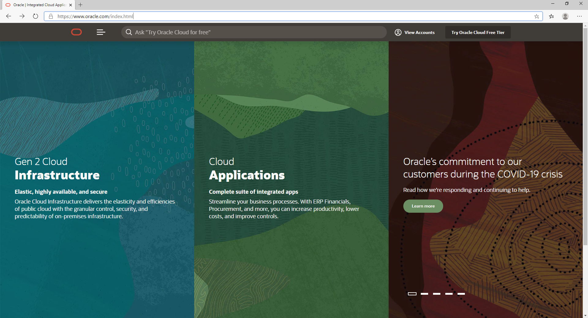
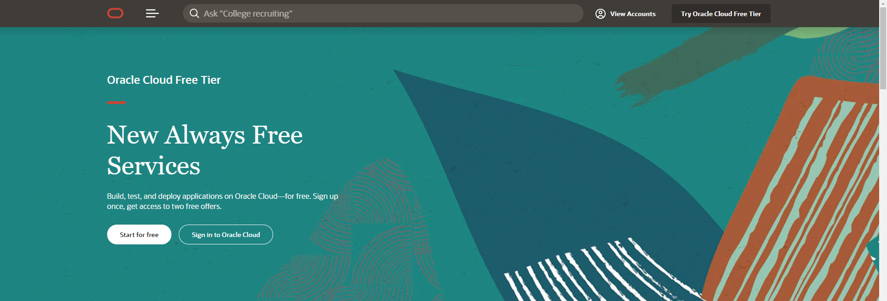
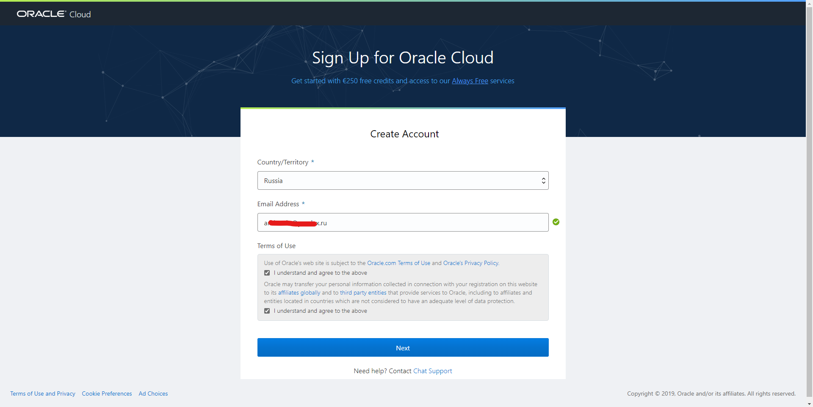
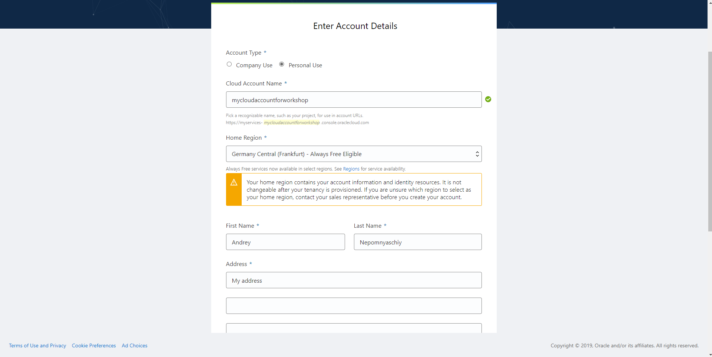
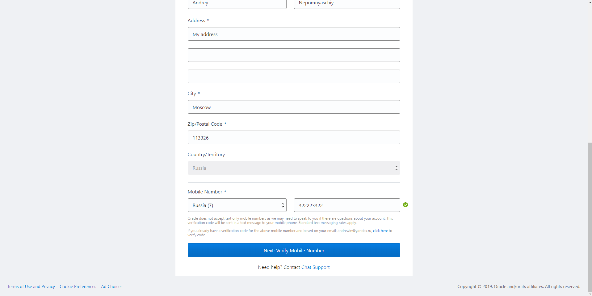
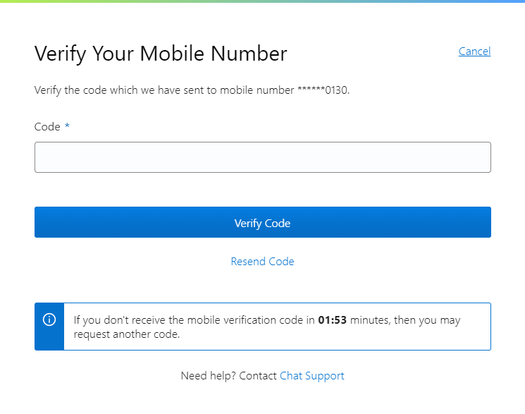
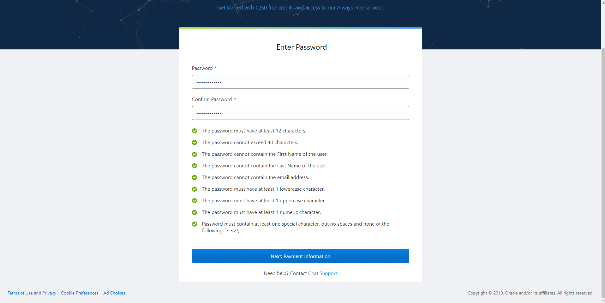
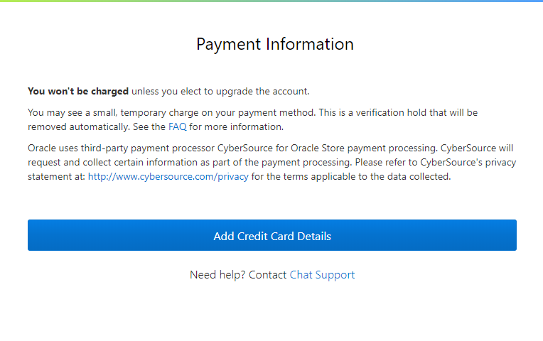

# Получение бесплатного тестового доступа к облачным сервисам Oracle

Откройте сайт Oracle: https://www.oracle.com/

Далее скриншоты приведены для английской версии сайта.

Нажмите **Try Oracle Cloud Free Tier**

Нажмите **Start for Free**

Выберите страну, введите ваш адрес электронной почты и поставьте галочки о согласии с условиями, затем нажмите **Next**.

**Важно использовать тот же адрес электронной почты, который вы указывали при регистрации на практикум.**

Далее введите информацию:

* Имя аккаунта, или Tenancy Name (по которому будет идентифицироваться аккаунт в облаке)
* Домашний регион (датацентр). Ознакомиться со списком регионов можно по ссылке: https://www.oracle.com/cloud/data-regions.html Регион выбирается для триального аккаунта один раз, и поменять его в будущем нельзя. 
* Некоторые регионы относятся к категории **Always Free Eligible** - это означает, что в них есть возможность бесплатного использования ряда ресурсов даже после окончания триала. Более подробно ознакомиться с возможностями **Always Free** можно по ссылке: https://docs.cloud.oracle.com/en-us/iaas/Content/FreeTier/freetier.htm Доступность таких ресурсов также зависит от текущей загрузки датацентра.
* Фамилию, имя и адрес (включая почтовый индекс). Желательно заполнять эту информацию на английском языке.

* Номер мобильного телефона, который будет проверен путем отправки SMS.

Затем нажмите **Next: Verify Mobile Number**.

Вам будет прислано сообщение с кодом, который необходимо ввести для проверки, и нажать **Verify Code**.

Если код не пришел в течение нескольких минут, его можно выслать повторно или попробовать другой номер мобильного телефона.

После проверки мобильного телефона придумайте и введите пароль от аккаунта. Обратите внимание на требования для пароля.

Затем нажмите **Next**.

**Обратите внимание! Если вы регистрируете триальный аккаунт на тот же email адрес, который указывали при регистрации практикума, и ранее вы не регистрировали на него триал в облаке Oracle, вам не потребуется вводить данные кредитной карты.**

Данные кредитной карты вводятся только для проверки. На карте может быть заблокирована (а через некоторое время возвращена) небольшая сумма. **За пользование облаком деньги с карты списываться не будут, если только вы сами явным образом не перейдете на платный доступ после окончания триала.**

После ввода данных кредитной карты и проверки вам на указанный email через некоторое время придет письмо с данными аккаунта и временным паролем.

Воспользуйтесь им для входа в аккаунт Oracle Cloud и поменяйте пароль на постоянный.

С этого момента вы можете пользоваться облачными сервисами Oracle в объеме 300 долларов (или 250 евро) в течение 30 дней (или меньше, если денежные средства закончатся раньше).