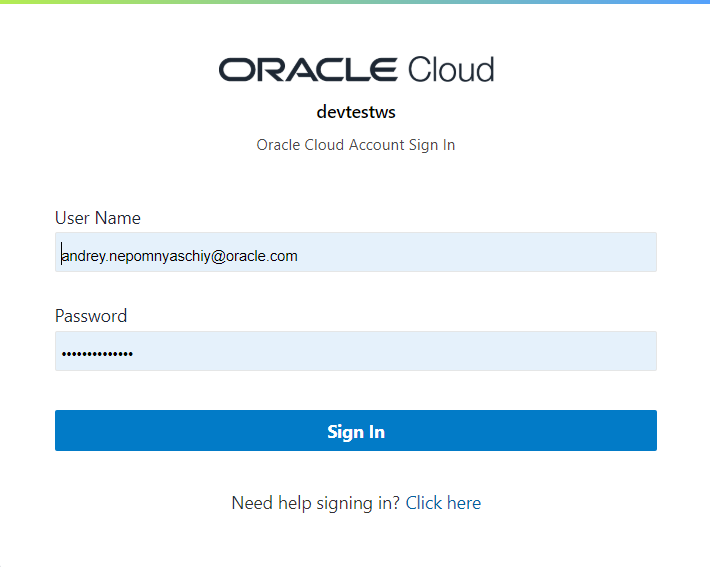
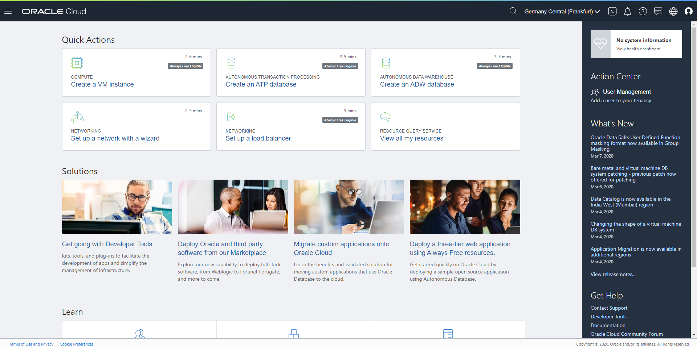
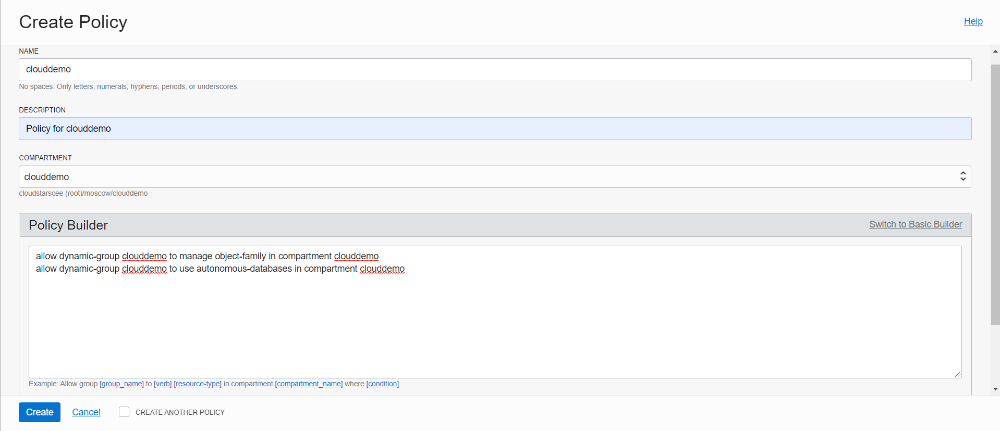

### [Содержание](index.md)

### [Назад: 1. Вводная часть](p1.md) 

### [Далее: 3. Подготовка: автономная база данных](p3.md)

# 2. Подготовка: доступ и управление ресурсами

## 2.1. Перед практикумом

Необходимо базовое знание командной строки Linux, понимание терминологии, используемой в облачных технологиях.

Прежде чем приступать к практикуму, убедитесь, что у вас имеется доступ к облаку Oracle (например, активированный Trial), учетная запись не заблокирована и пароль к ней не утрачен.

Активировать Trial можно по ссылке: https://www.oracle.com/ru/cloud/free/

При активации Trial можно выбрать один «домашний» регион. При выборе региона ориентируйтесь на свои географические предпочтения. В разных регионах доступность некоторых ресурсов может отличаться, однако цены на сервисы одинаковы для всех регионов.

Также в разных регионах имеется разное количество Availability Domains. Это может влиять на количество ресурсов, одновременно доступных в Trial.

Список регионов: https://docs.cloud.oracle.com/en-us/iaas/Content/General/Concepts/regions.htm

Практикум будет демонстрироваться на базе региона **Frankfurt**, имеющего 3 Availability Domains.

## 2.2. Доступ к облаку Oracle

Для работы вам потребуется интернет-браузер. Рекомендуется отключить расширения браузера, влияющие на содержимое (например, блокировщики рекламы и анонимайзеры).


Зайдите на сайт https://oracle.com, нажмите **View Accounts**, а затем **Sign in to Cloud** (На других языках надписи будут различаться).


Введите имя аккаунта, которое было задано при создании учетной записи, и нажмите **Next**.

Имя аккаунта можно проверить в первоначальном письме с учетными данными Oracle Cloud.



Введите имя и пароль учетной запись Oracle Cloud.

Вы попадете на приборную панель облака Oracle.

Здесь вы можете проверить остаток средств на балансе, увидеть сводку по используемым сервисам и т.д.

Чтобы перейти в консоль управления инфраструктурой, нажмите на кнопку **Infrastructure**. Возможно, потребуется еще раз ввести имя аккаунта и нажать **Next**.

Также можно пройти в панель управления инфраструктурой по прямой ссылке: https://cloud.oracle.com



## 2.3. Запуск Cloud Shell

**Cloud Shell** – это встроенная консоль для работы с Oracle Cloud Infrastructure. Она доступна из любого браузера и не требует установки дополнительного ПО.

Описание Cloud Shell:
<https://docs.cloud.oracle.com/en-us/iaas/Content/API/Concepts/cloudshellintro.htm>


Нажмите на кнопку запуска Cloud Shell рядом с названием региона (справа вверху).

Будет запущен Cloud Shell в том же самом окне браузера.

В состав ПО, установленного в Cloud Shell, входит клиент командной строки OCI CLI, docker, kubectl, sqlplus, terraform, ansible и ряд другого ПО.

Cloud Shell имеет доступ в Интернет, но к консоли Cloud Shell нельзя подключиться извне по ssh.

Доступ к правам суперпользователя не предоставляется.

Размер домашней папки пользователя, которая сохраняется даже при неработающем Cloud Shell, составляет 5 ГБ. Эта папка будет удалена при неиспользовании Cloud Shell более 6 месяцев.

Другие папки, за исключением домашней, являются эфемерными. Например, если собрать Docker контейнер, то он не будет доступен при следующем запуске Cloud Shell и его придется собирать заново. Однако конфигурация Docker для доступа к репозиторию, которая сохраняется в домашней папке, останется.

**Для доступа к Clipboard в Cloud Shell используются следующие сочетания клавиш:**

  - **Ctrl-Insert – Скопировать**

  - **Shift-Insert – Вставить**

## 2.4. Создание Compartment (Отделения) для размещения ресурсов

Compartment - это логическое объединение облачных ресурсов по типу, рабочей группе, назначению и/или для облегчения отслеживания расходов.

Также Compartments используются для управления доступом к ресурсам.

Создайте Compartment с именем **clouddemo**. Для этого перейдите в главном меню в раздел **Identity / Compartments**.


Введите имя Compartment: **clouddemo** в поле **Name**, и описание в поле **Description** (это поле является обязательным). Затем нажмите **Create Compartment**.

Перейдите во вновь созданный Compartment и обратите внимание на его идентификатор (**OCID**). Он нам потребуется в дальнейшем.


## 2.5. Создание Bucket в объектном хранилище для хранения изображений

В главном меню перейдите в раздел **Object Storage / Object Storage**.

Убедитесь, что выбран правильный Compartment: **clouddemo**.


Нажмите **Create Bucket**.


Введите имя Bucket: **clouddemo-public**.

Остальные параметры можно оставить без изменения.

Пролистайте ниже и нажмите **Create Bucket**.

Нажмите на меню вновь созданного Bucket (три точки справа) и выберите пункт Edit Visibility.


В открывшемся окне выберите **Public** и нажмите **Save Changes**.


Благодаря этому приложение сможет генерировать общедоступные ссылки на загруженные изображения, и пользователи приложения смогут их скачивать без необходимости авторизации.

## 2.6. Создание разрешений для доступа к объектному хранилищу и автономной базе данных

Перейдите в раздел **Identity / Compartments**, выберите Compartment **clouddemo** и скопируйте его OCID.

Выберите в меню слева раздел **Dynamic Groups** и нажмите **Create Dynamic Group**.

Введите имя динамической группы: **clouddemo**, описание (обязательный параметр), а в поле Rule 1 введите 

``` 
instance.compartment.id = 'ocid1.compartment.oc1..aaaaa.....ywa'
```

Вставьте OCID вашего compartment. **OCID должен быть заключен в одинарные кавычки**.


Нажмите **Create**.

Теперь в созданную динамическую группу попадут все виртуальные машины, созданные внутри Compartment с указанным OCID (т.е. **clouddemo**).

Выберите в меню слева раздел **Policies** и нажмите **Create Policy**.

Введите имя политики: **clouddemo**, описание (обязательный параметр).

В разделе Policy Builder нажмите **Customize (Advanced)**, и в поле для текста политики введите:

```
allow dynamic-group clouddemo to manage object-family in compartment clouddemo
allow dynamic-group clouddemo to use autonomous-databases in compartment clouddemo
```



Нажмите **Create**.

Теперь все виртуальные машины, попадающие в ранее созданную динамическую группу (а именно приложения, работающие на этих виртуальных машинах), смогут управлять объектным хранилищем в указанном Compartment.

## 2.7. Работа с OCI CLI

OCI CLI - это интерфейс командной строки для управления ресурсами в OCI. OCI CLI встроен в Cloud Shell, при этом не требуется аутентификация (т.к. пользователь Cloud Shell уже прошел аутентификацию).

Описание CLI: https://docs.cloud.oracle.com/en-us/iaas/Content/API/Concepts/cliconcepts.htm

Проверить работу CLI можно командой:

##### [003]

```bash
$ oci os ns get
```

```bash
{
  "data": "frxhexdipnsp"
}
```

Результат этой команды – json, содержащий в поле “data” название вашего **namespace** (оно будет использовано в дальнейшем).

Выделить значение namespace из json можно командой **jq**:

##### [004]

```bash
$ oci os ns get |jq -r ".data"
```

```bash
frxhexdipnsp
```

Это значение используется в дальнейшем во многих командах. Чтобы каждый раз не вводить его, создадим переменную **NAMESPACE**.

##### [005]

```bash
$ export NAMESPACE=`oci os ns get |jq -r '.data'`
```

```bash
$ echo "export NAMESPACE=$NAMESPACE" >> $HOME/.bashrc
```
Также необходимо сохранить значение текущего региона.

Оно присутствует в строке Cloud Shell:

`andrey_nep@cloudshell:~ (eu-frankfurt-1)$`

Также его можно получить через CLI:

##### [006]

```bash
$ oci iam region-subscription list |jq -r '.data[]."region-name"'
```

```bash
eu-frankfurt-1
```

Сохраним его в переменную **REGION** для дальнейшего использования в
командах.

##### [007]

```bash
$ export REGION=eu-frankfurt-1
```

```bash
$ echo "export REGION=$REGION" >> $HOME/.bashrc
```

Проверьте значения переменных **NAMESPACE** и **REGION**:

##### [008]

```bash
$ echo $NAMESPACE && echo $REGION
```

```
frxhexdipnsp
eu-frankfurt-1
```

## 2.8. Создание разрешений для доступа к Docker репозиторию.

Обзор сервиса OCIR:
<https://docs.cloud.oracle.com/en-us/iaas/Content/Registry/Concepts/registryoverview.htm>

Воспользуемся OCI CLI для создания необходимых разрешений для доступа к Docker репозиторию.

``` bash
$ oci iam group create --name "docker-group" --description "Group for Docker" |jq -r ".data.id"
```

```
ocid1.group.oc1..aaaaaaaadj7w6au6shn7andux2akyiohlmubqocy27uohda5c57ensmsh4nq
```

В результате будет создана группа  `docker-group` и выведен ее OCID.

```bash
$ oci iam user create --name "docker-user" --description "User for Docker" | jq -r ".data.id"
```

```
ocid1.user.oc1..aaaaaaaalwe2eydr7prsbmguwozq6lzyyc63mtctm3zgdsm6ilf4c75qesvq
```

В результате будет создан пользователь `docker-user` и выведен его OCID.

```bash
$ oci iam group add-user --user-id <User OCID> --group-id <Group OCID>
```

Вставьте вместо <User OCID> и <Group OCID> соответственно OCID пользователя и группы, полученные ранее.

В результате пользователь `docker-user` будет добавлен в группу `docker-group`.

Получим OCID нашего корневого Compartment (tenancy).

```bash
$ oci iam compartment list | jq -r '.data[0]."compartment-id"'
```

```
ocid1.tenancy.oc1..aaaaaaaavbwgxhwzvoujoud2hq6yls6axa3ulpclqmkms643h66uwi2gnpqq
```

Добавим политику, разрешающую группе docker-group управлять Docker репозиториями в tenancy.

```bash
$ oci iam policy create --compartment-id <Tenancy OCID> --name "docker-policy" --description "Docker policy" --statements '["allow group docker-group to manage repos in tenancy"]'
```

Вставьте вместо <Tenancy OCID> OCID вашего Tenancy, полученное на предыдущем шаге.

Обратите внимание, что политики для доступа к Docker репозиторию задаются в настоящее время на уровне Tenancy, а не Compartment, поэтому в вышеуказанной команде в качестве compartment-id используется OCID Tenancy.

## 2.9. Создание токена для подключения к Docker репозиторию

Выполните следующую команду для генерации токена:

```bash
$ oci iam auth-token create --description workshop --user-id <paste User OCID here> |jq ".data.token"
```

Вставьте в команду OCID пользователя **docker-user**.

В результате будет сгенерирован токен с именем `workshop` и отображен в выводе команды. Токен можно скопировать и использовать в качестве пароля при подключении к Docker репозиторию.

Альтернативно можно сгенерировать токен в консоли. Если вы уже сгенерировали его в командной строке, то генерировать еще один в консоли не нужно.

Войдите в меню пользователя **docker-user** (**Identity / Users**).

Пролистайте ниже и выберите слева внизу **Auth Tokens**

Нажмите **Generate Token** и введите имя токена.


Нажмите **Generate Token**.

Будет сгенерирован токен.


Токен отображается только один раз\! Скопируйте его и сохраните, например, в текстовом редакторе.

## 2.10. Подключение к Docker репозиторию

Выполните следующие команды:

##### [022]

```bash
$ docker login $REGION.ocir.io -u `oci os ns get |jq -r ".data"`/docker-user -p "<Paste Your Token Here>"
```

```
WARNING! Using --password via the CLI is insecure. Use --password-stdin.
WARNING! Your password will be stored unencrypted in /home/andrey_nep/.docker/config.json.
Configure a credential helper to remove this warning. See
https://docs.docker.com/engine/reference/commandline/login/#credentials-store

Login Succeeded
```

В качестве пароля используйте токен, который был сгенерирован на предыдущем шаге. Пароль должен быть заключен в кавычки, т.к. в нем могут содержаться специальные символы.

В результате должен быть получен ответ: `Login Succeeded`. Убедитесь в этом, прежде чем приступать к следующему шагу.

### [Назад: 1. Вводная часть](p1.md) 

### [Далее: 3. Подготовка: автономная база данных](p3.md)
