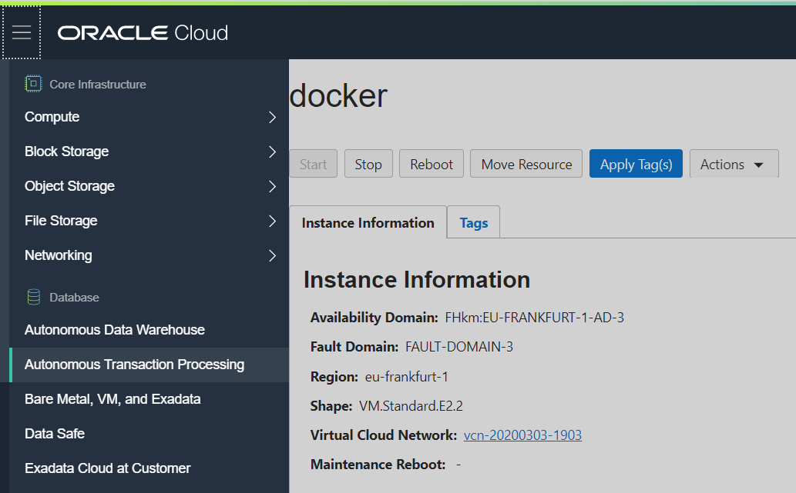
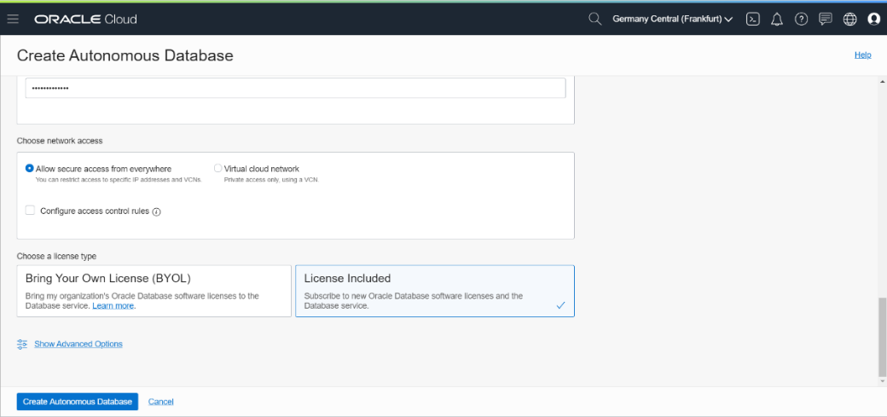
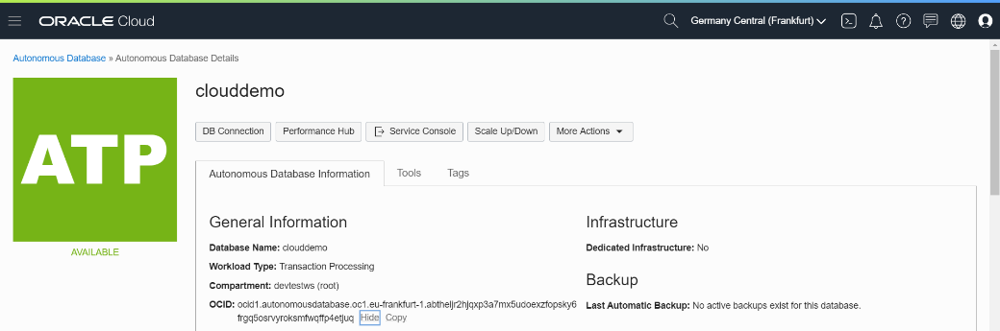

### [Содержание](../../README.md)

### [Назад: 2. Подготовка: OCI CLI](p2.md)
### [Далее: 4. Подготовка инфраструктуры](p4.md)

# 3. Подготовка: автономная база данных

## 3.1. Создание автономной базы данных

Обзор автономной базы данных Oracle:
<https://docs.cloud.oracle.com/en-us/iaas/Content/Database/Concepts/adboverview.htm>

В автономную базу данных будет помещаться распознанный текст и статистика.

Перейдите из бокового меню в раздел **Autonomous Transaction Processing** и нажмите **Create Autonomous Database**.

Введите имя базы данных. Рекомендуется использовать **clouddemo**, отображаемое имя **clouddemo**,
т.к. эти наименования используются в дальнейшем.

Убедитесь, что тип нагрузки выбран Transaction Processing.

Пролистайте ниже и введите параметры создаваемой базы данных.

Для практикума нам достаточно 1 OCPU (ядра) и 1 ТБ хранилища.

Если вы работаете в Trial, то можно выбрать базу данных **Always Free**, включив соответствующий переключатель. В этом случае выбор будет ограничен 1 OCPU и 20 ГБ хранилища. Также будет недоступен выбор версии базы данных, но для целей практикума эти ограничения не имеют значения.

Auto scaling для целей практикума не потребуется.


Введите пароль администратора базы данных и сохраните его в безопасном месте.

Для практикума параметры сетевого доступа можно оставить по умолчанию.



По правилам лицензирования базы данных вы должны выбрать пункт License Included.

Нажмите Create Autonomous Database. Создание автономной базы данных займет 1-2 минуты.

## 3.2. Получение реквизитов для безопасного доступа к базе данных

Перейдите в консоль управления автономной базой данных и скопируйте ее OCID.

Прежде чем продолжить, убедитесь, что база данных создана и доступна (находится в состоянии **Available**).

В консоли Cloud Shell выполните команду (вставьте скопированный OCID автономной базы данных после --autonomous-database-id).

##### [011]

```bash
$ mkdir workshop && cd workshop
```

```bash
$ oci db autonomous-database generate-wallet --autonomous-database-id <paste ADB OCID here> --file wallet.zip --password mypassword1 --generate-type SINGLE
```

```
Downloading file
[####################################]
100%
```

```bash
$ ls
```

```bash
wallet.zip
```

В результате будет создана папка workshop и сгенерирован wallet для безопасного доступа к автономной базе данных.

## 3.3. Создание пользователей и таблиц

Распакуйте созданный wallet.zip в папку .wallet:

##### [012]

```bash
$ unzip wallet.zip -d $HOME/.wallet
```

```
Archive: wallet.zip
inflating: /home/andrey\_nep/.wallet/cwallet.sso
inflating: /home/andrey\_nep/.wallet/tnsnames.ora
inflating: /home/andrey\_nep/.wallet/readme.md
inflating: /home/andrey\_nep/.wallet/truststore.jks
inflating: /home/andrey\_nep/.wallet/ojdbc.properties
inflating: /home/andrey\_nep/.wallet/sqlnet.ora
inflating: /home/andrey\_nep/.wallet/ewallet.p12
inflating: /home/andrey\_nep/.wallet/keystore.jks
```

```bash
$ ls $HOME/.wallet
```

```
cwallet.sso ewallet.p12 keystore.jks ojdbc.properties readme.md sqlnet.ora tnsnames.ora truststore.jks
```

Теперь нужно создать переменную TNS\_ADMIN, которая будет указывать на
папку с wallet.

##### [013]

```bash
$ export TNS_ADMIN=$HOME/.wallet
```

```bash
$ echo "export TNS_ADMIN=$HOME/.wallet" >> $HOME/.bashrc
```

Вторая команда необходима, чтобы переменная сохранялась при перезапуске Cloud Shell.

Отредактируйте файл **sqlnet.ora**, чтобы он указывал на расположение **.wallet**.

##### [014]

```bash
$ nano $HOME/.wallet/sqlnet.ora
```


Вставьте в поле DIRECTORY строку $TNS\_ADMIN.

До замены:

```
WALLET_LOCATION = (SOURCE = (METHOD = file) (METHOD_DATA = (DIRECTORY="?/network/admin")))
```

После замены:

```
WALLET_LOCATION = (SOURCE = (METHOD = file) (METHOD_DATA = (DIRECTORY="$TNS_ADMIN")))
```

Для выхода из nano используйте Ctrl-X. Если вы изменяли файл, то программа предложит его сохранить. Нажмите Y и Enter для сохранения файла.

Проверьте, что редактирование файла прошло успешно.

##### [015]

```bash
$ cat $HOME/.wallet/sqlnet.ora
```

```
WALLET_LOCATION = (SOURCE = (METHOD = file) (METHOD_DATA = (DIRECTORY="$TNS_ADMIN")))
SSL_SERVER_DN_MATCH=yes
```

Теперь запустите **sqlplus** и подключитесь к автономной базе данных **clouddemo** от имени администратора (**admin**). sqlplus будет использовать в качестве wallet для доступа к базе данных папку, указанную в переменной **TNS\_ADMIN**.

Введите пароль администратора, который вы указывали при создании базы данных.

##### [016]

```bash
$ sqlplus admin@clouddemo_tp
```

```
SQL*Plus: Release 19.0.0.0.0 - Production on Thu Mar 26 08:17:47 2020
Version 19.5.0.0.0
Copyright (c) 1982, 2019, Oracle. All rights reserved.
Enter password:

Last Successful login time: Wed Mar 25 2020 15:15:32 +00:00
Connected to:
Oracle Database 18c Enterprise Edition Release 18.0.0.0.0 - Production
Version 18.4.0.0.0

SQL>
```

Выполните в sqlplus следующие команды:

##### [017]

```sql
SQL> create user demo identified by myWSPassword_01;
```

```
User created.
```

```sql
SQL> grant create session, resource to demo;
```

```
Grant succeeded.
```

```sql
SQL> grant unlimited tablespace to demo;
```

```
Grant succeeded.
```

где **myWSPassword\_01** замените на ваш пароль пользователя demo.

Пароль должен содержать английские прописные и строчные буквы, как минимум одну цифру и специальный символ.

Перейдите в схему demo. **Важно\! Дальнейший доступ к базе данных, в том числе из приложения, осуществляется от имени пользователя demo, в схеме demo.**

##### [018]

```sql
SQL> alter session set current_schema = demo;
```

```
Session altered.
```

Выполните команду для создания таблицы:

##### [019]

```sql
SQL> CREATE TABLE "DEMO"."OCR"
("ID" NUMBER GENERATED BY DEFAULT ON NULL AS IDENTITY,
 "HOSTNAME" VARCHAR2(127 BYTE),
 "FILENAME" VARCHAR2(255 BYTE),
 "STARTTIME" DATE,
 "ENDTIME" DATE,
 "DURATION" NUMBER(7,2),
 "FINISHED" NUMBER(2,0),
 "TEXT" VARCHAR2(32000 BYTE),
 "TOKEN" VARCHAR2(64 BYTE),
 "LINK" VARCHAR2(1024 BYTE),
 "IPADDR" VARCHAR2(256 BYTE),
 "USERAGENT" VARCHAR2(256 BYTE));
```

```
  2    3    4    5    6    7    8    9   10   11   12   13   14  
Table created.
```

Выйдите из sqlplus:

##### [020]

```sql
SQL> quit
```

В качестве альтернативы sqlplus можно использовать SQL Developer или SQL Developer Web:

В окне детальной информации о базе данных выберите пункт Tools и нажмите Open SQL Developer Web.

Войдите от имени admin.

В окне SQL Developer Web нужно запустить те же команды, которые приведены для sqlplus. Если вы их уже запускали в sqlplus, повторно выполнять их в SQL Developer не нужно.

### [Назад: 2. Подготовка: OCI CLI](p2.md)
### [Далее: 4. Подготовка инфраструктуры](p4.md)