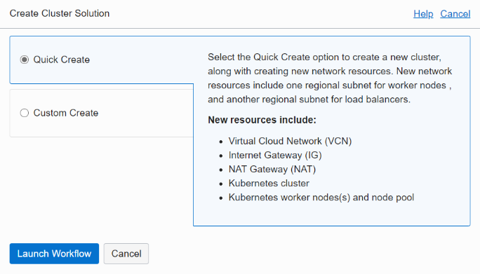
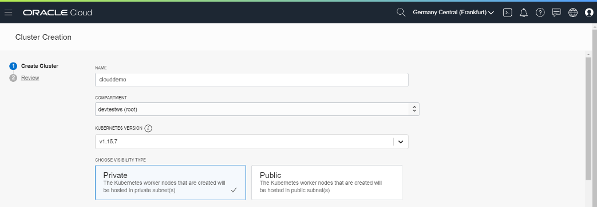
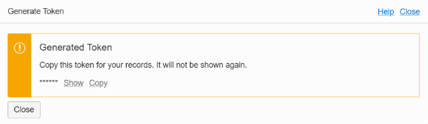

### [Содержание](../../README.md)

### [Назад: 3. Подготовка (продолжение)](p3.md)
### [Далее: 5. Запуск приложения](p5.md)
# 4. Подготовка инфраструктуры для запуска приложения

## 4.1. Создание кластера Kubernetes

Обзор сервиса OKE: https://docs.cloud.oracle.com/en-us/iaas/Content/ContEng/Concepts/contengoverview.htm

Поскольку создание кластера занимает 5-7 минут, запустите его создание, прежде чем перейти к дальнейшим шагам.


Откройте в боковом меню **Developer Services** / **Container Clusters**

В открывшемся окне управления кластерами Kubernetes нажмите **Create Cluster**



Выберите **Quick Create** и нажмите **Launch Workflow**



Выберите параметры создаваемого кластера:

Имя (например, **clouddemo**).

Версию Kubernetes: например, последнюю доступную.

Выберите **Private**, чтобы рабочие узлы не были доступны извне.


Пролистайте ниже и выберите конфигурацию виртуальных машин рабочих узлов.

Рекомендуется **VM.Standard.E2.1**

Количество узлов: **3**

Нажмите **Show Advanced Options** и вставьте ваш публичный ключ ssh (если в дальнейшем вам нужно будет подключиться к рабочим узлам по ssh).

Остальные опции можно оставить без изменений.

Нажмите **Next** для запуска процесса создания кластера Kubernetes.

Создание кластера и 3 рабочих узлов занимает 5-7 минут.

При создании кластера вы управляете только рабочими узлами. Отказоустойчивые мастер-узлы управляются Oracle.

Когда мастер-узлы будут созданы, вы уже можете подключаться к кластеру.

## 4.2. Создание токена для подключения к Docker репозиторию

Обзор сервиса OCIR:
<https://docs.cloud.oracle.com/en-us/iaas/Content/Registry/Concepts/registryoverview.htm>

Войдите в меню пользователя **api** (**Identity / Users**).

Пролистайте ниже и выберите слева внизу **Auth Tokens**

Нажмите **Generate Token** и введите имя токена.


Нажмите Generate Token.

Будет сгенерирован токен.



Токен отображается только один раз\! Скопируйте его и сохраните, например, в текстовом редакторе.

Альтернативно вы можете использовать команду CLI для генерации токена:

##### [021]

```bash
$ oci iam auth-token create --user-id <paste User OCID here> --description workshop |jq ".data.token"
```

Вставьте в команду OCID пользователя **api**.

В результате будет сгенерирован токен с именем workshop и отображен в выводе команды. Токен можно скопировать и использовать в качестве пароля при подключении к Docker репозиторию.

## 4.3. Подключение к Docker репозиторию

Выполните следующие команды:

##### [022]

```bash
$ docker login $REGION.ocir.io -u $NAMESPACE/api -p "<Paste Your Token Here>"
```

```
WARNING! Using --password via the CLI is insecure. Use --password-stdin.
WARNING! Your password will be stored unencrypted in /home/andrey_nep/.docker/config.json.
Configure a credential helper to remove this warning. See
https://docs.docker.com/engine/reference/commandline/login/#credentials-store

Login Succeeded
```

В качестве пароля используйте токен, который был сгенерирован на предыдущем шаге. Пароль должен быть заключен в кавычки, т.к. в нем могут содержаться специальные символы.

В результате должен быть получен ответ: Login Succeeded. Убедитесь в этом, прежде чем приступать к следующему шагу.

## 4.4. Загрузка приложения

Приложение clouddemo-micro размещено на github. Чтобы его загрузить, выполните команду:

##### [023]

```bash
$ git clone https://github.com/andreynepo/clouddemo-micro.git
```

Перейдите в папку clouddemo-micro.

```bash
$ cd clouddemo-micro
```

Отредактируйте файл db.py и убедитесь, что данные имени пользователя и пароля актуальны.

##### [024]

```bash
$ nano clouddemo-db/docker/context/app/db.py
```

Пролистайте вниз.


При необходимости откорректируйте значения.

```
dbuser="demo"
dbpw="myWSPassword_01"
connstr="clouddemo_tp"
```

Для выхода из nano используйте **Ctrl-X**. Если вы изменяли файл, то программа предложит его сохранить. Нажмите **Y** и **Enter** для сохранения файла.

## 4.5. Сборка Docker-контейнеров с микросервисным приложением

Выполните следующие команды:

##### [025]

```bash
$ docker build -t $REGION.ocir.io/$NAMESPACE/clouddemo-micro/front clouddemo-front/docker/
```

```bash
$ docker build -t $REGION.ocir.io/$NAMESPACE/clouddemo-micro/api clouddemo-api/docker/
```

```bash
$ docker build -t $REGION.ocir.io/$NAMESPACE/clouddemo-micro/db clouddemo-db/docker/
```

```bash
$ docker build -t $REGION.ocir.io/$NAMESPACE/clouddemo-micro/wc clouddemo-wc/docker/
```

Должны быть без ошибок собраны 4 новых образа. Их можно посмотреть следующей командой.

##### [026]

```bash
$ docker images
```

```
REPOSITORY                                                  TAG                 IMAGE ID            CREATED              SIZE
eu-frankfurt-1.ocir.io/frxhexdipnsp/clouddemo-micro/wc      latest              e4e33db2734a        About a minute ago   307MB
eu-frankfurt-1.ocir.io/frxhexdipnsp/clouddemo-micro/db      latest              5d5e3e68ef99        2 minutes ago        330MB
eu-frankfurt-1.ocir.io/frxhexdipnsp/clouddemo-micro/api     latest              9e0ce5409f3d        2 minutes ago        353MB
eu-frankfurt-1.ocir.io/frxhexdipnsp/clouddemo-micro/front   latest              8080589f8166        4 minutes ago        95MB
python                                                      3.7-slim            74ac77e9873a        38 hours ago         179MB
debian                                                      buster-slim         8e022c70c28b        2 days ago           69.2MB
```

## 4.6. Выгрузка созданные контейнеры в Docker репозиторий.

Выполните следующие команды:

##### [027]

```bash
$ docker push $REGION.ocir.io/$NAMESPACE/clouddemo-micro/front
```

```bash
$ docker push $REGION.ocir.io/$NAMESPACE/clouddemo-micro/api
```

```bash
$ docker push $REGION.ocir.io/$NAMESPACE/clouddemo-micro/db
```

```bash
$ docker push $REGION.ocir.io/$NAMESPACE/clouddemo-micro/wc
```


Выгруженные контейнеры можно посмотреть. Для этого перейдите в меню **Developer Services / Registry (OCIR)**.

Убедитесь, что все 4 образа успешно выгружены.

### [Назад: 3. Подготовка (продолжение)](p3.md)
### [Далее: 5. Запуск приложения](p5.md)