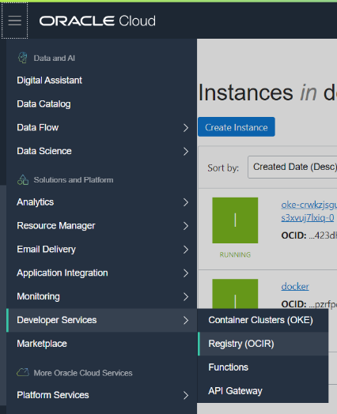

### [Содержание](index.md)

### [Назад: 3. Подготовка: автономная база данных](p3.md)

### [Далее: 5. Запуск приложения](p5.md)
# 4. Подготовка инфраструктуры для запуска приложения

## 4.1. Создание кластера Kubernetes

Обзор сервиса OKE: https://docs.cloud.oracle.com/en-us/iaas/Content/ContEng/Concepts/contengoverview.htm

Поскольку создание кластера занимает 5-7 минут, запустите его создание, прежде чем перейти к дальнейшим шагам.


Откройте в боковом меню **Developer Services** / **Container Clusters**

В открывшемся окне управления кластерами Kubernetes нажмите **Create Cluster**


Выберите **Quick Create** и нажмите **Launch Workflow**


Выберите параметры создаваемого кластера:

Имя (например, **clouddemo**).

Версию Kubernetes: например, последнюю доступную.

Выберите **Private**, чтобы рабочие узлы не были доступны извне.


Пролистайте ниже и выберите конфигурацию виртуальных машин рабочих узлов.

Рекомендуется **VM.Standard.E2.1**

Количество узлов: **3**

Нажмите **Show Advanced Options** и вставьте ваш публичный ключ ssh (если в дальнейшем вам нужно будет подключиться к рабочим узлам по ssh).

Остальные опции можно оставить без изменений.

Нажмите **Next** для запуска процесса создания кластера Kubernetes.

Создание кластера и 3 рабочих узлов занимает 5-7 минут.

При создании кластера вы управляете только рабочими узлами. Отказоустойчивые мастер-узлы управляются Oracle.

Когда мастер-узлы будут созданы, вы уже можете подключаться к кластеру.

## 4.2. Загрузка приложения

Приложение **clouddemo-micro** размещено на **github**. Чтобы его загрузить, выполните команду:

##### [023]

```bash
$ git clone https://github.com/andreynepo/clouddemo-micro.git
```

Перейдите в папку clouddemo-micro.

```bash
$ cd clouddemo-micro
```

## 4.5. Сборка Docker-образов с микросервисным приложением

Выполните следующие команды:

##### [025]

```bash
$ docker build -t $REGION.ocir.io/$NAMESPACE/clouddemo-micro/front $HOME/workshop/clouddemo-micro/clouddemo-front/docker/
```

```bash
$ docker build -t $REGION.ocir.io/$NAMESPACE/clouddemo-micro/api $HOME/workshop/clouddemo-micro/clouddemo-api/docker/
```

```bash
$ docker build -t $REGION.ocir.io/$NAMESPACE/clouddemo-micro/ocr $HOME/workshop/clouddemo-micro/clouddemo-ocr/docker/
```

```bash
$ docker build -t $REGION.ocir.io/$NAMESPACE/clouddemo-micro/db $HOME/workshop/clouddemo-micro/clouddemo-db/docker/
```

```bash
$ docker build -t $REGION.ocir.io/$NAMESPACE/clouddemo-micro/wc $HOME/workshop/clouddemo-micro/clouddemo-wc/docker/
```


Или все 5 команд одной строкой:

```bash
$ docker build -t $REGION.ocir.io/$NAMESPACE/clouddemo-micro/front $HOME/workshop/clouddemo-micro/clouddemo-front/docker/ && docker build -t $REGION.ocir.io/$NAMESPACE/clouddemo-micro/api $HOME/workshop/clouddemo-micro/clouddemo-api/docker/ && docker build -t $REGION.ocir.io/$NAMESPACE/clouddemo-micro/ocr $HOME/workshop/clouddemo-micro/clouddemo-ocr/docker/ && docker build -t $REGION.ocir.io/$NAMESPACE/clouddemo-micro/db $HOME/workshop/clouddemo-micro/clouddemo-db/docker/ && docker build -t $REGION.ocir.io/$NAMESPACE/clouddemo-micro/wc $HOME/workshop/clouddemo-micro/clouddemo-wc/docker/
```

Должны быть без ошибок собраны 5 новых образов. Их можно посмотреть следующей командой.

##### [026]

```bash
$ docker images
```

```
REPOSITORY                                                  TAG                 IMAGE ID            CREATED              SIZE
eu-frankfurt-1.ocir.io/frxhexdipnsp/clouddemo-micro/wc      latest              e4e33db2734a        About a minute ago   307MB
eu-frankfurt-1.ocir.io/frxhexdipnsp/clouddemo-micro/db      latest              5d5e3e68ef99        2 minutes ago        330MB
eu-frankfurt-1.ocir.io/frxhexdipnsp/clouddemo-micro/api     latest              9e0ce5409f3d        2 minutes ago        353MB
eu-frankfurt-1.ocir.io/frxhexdipnsp/clouddemo-micro/front   latest              8080589f8166        4 minutes ago        95MB
python                                                      3.7-slim            74ac77e9873a        38 hours ago         179MB
debian                                                      buster-slim         8e022c70c28b        2 days ago           69.2MB
```

## 4.6. Выгрузка созданных образов в Docker репозиторий

Выполните следующие команды:

##### [027]

```bash
$ docker push $REGION.ocir.io/$NAMESPACE/clouddemo-micro/front
```

```bash
$ docker push $REGION.ocir.io/$NAMESPACE/clouddemo-micro/api
```

```bash
$ docker push $REGION.ocir.io/$NAMESPACE/clouddemo-micro/ocr
```

```bash
$ docker push $REGION.ocir.io/$NAMESPACE/clouddemo-micro/db
```

```bash
$ docker push $REGION.ocir.io/$NAMESPACE/clouddemo-micro/wc
```

Или все 5 команд одной строкой:

```bash
$ docker push $REGION.ocir.io/$NAMESPACE/clouddemo-micro/front && docker push $REGION.ocir.io/$NAMESPACE/clouddemo-micro/api && docker push $REGION.ocir.io/$NAMESPACE/clouddemo-micro/ocr && docker push $REGION.ocir.io/$NAMESPACE/clouddemo-micro/db && docker push $REGION.ocir.io/$NAMESPACE/clouddemo-micro/wc
```




Выгруженные образы можно посмотреть. Для этого перейдите в меню **Developer Services / Registry (OCIR)**.

Убедитесь, что все 5 образов успешно выгружены.

### [Назад: 3. Подготовка: автономная база данных](p3.md)
### [Далее: 5. Запуск приложения](p5.md)