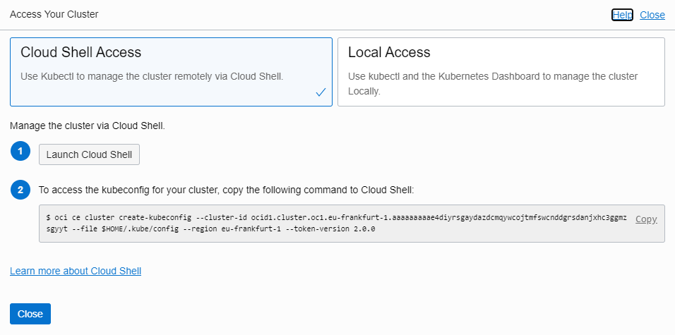

### [Содержание](index.md)

### [Назад: 4. Подготовка инфраструктуры](p4.md)

### [Далее: 6. Работа с кластером Kubernetes](p6.md)

# 5. Запуск микросервисного приложения

## 5.1. Подключение к кластеру Kubernetes

Перейдите в параметры кластера Kubernetes: **Developer Services /
Container Clusters (OKE)** и выберите ваш кластер.

Убедитесь, что кластер Kubernetes создан и активен: Cluster Status Active (в этом случае кнопка **Access Cluster** станет активна).

Нажмите **Access Cluster** и следуйте инструкциям.



Скопируйте из открывшегося окна и выполните следующие команды:

##### [028]

```bash
$ oci ce cluster create-kubeconfig --cluster-id <Paste Cluster OCID Here> --file
$HOME/.kube/config --region eu-frankfurt-1 --token-version 2.0.0
```

```
New config written to the Kubeconfig file /home/andrey_nep/.kube/config
```

Если вы скопировали команду из окна, то менять в ней ничего не нужно.


## 5.2. Подключение кластера Kubernetes к Docker репозиторию

Выполните команду:

##### [029]

```bash
$ kubectl create secret generic docker-wallet --from-file=.dockerconfigjson=$HOME/.docker/config.json --type=kubernetes.io/dockerconfigjson
```

```
secret/docker-wallet created
```

Эта команда создает из конфигурации Docker (которую мы создавали командой `docker login`) аналогичную конфигурацию Kubernetes.

Теперь кластер Kubernetes сможет загружать контейнеры из нашего Docker репозитория.

## 5.3. Создание secret в кластере для подключения к базе данных и объектному хранилищу

Выполните следующие команды:

##### [030]

```bash
$ kubectl create secret generic db-wallet --from-file=$HOME/.wallet
```

```
secret/db-wallet created
```

```bash
$ kubectl create secret generic oci-wallet --from-file=$HOME/.oci
```

```
secret/oci-wallet created
```

```bash
$ kubectl create secret generic db-secret --from-literal=username=demo --from-literal=password=myWSPassword_01 --from-literal=connection=clouddemo_tp
```

```
secret/db-secret created
```

При необходимости замените данные имени пользователя, пароля и соединения на актуальные.

Проверить результат можно командами:

##### [031]

```bash
$ kubectl get secrets
```

```
NAME                  TYPE                                  DATA   AGE
db-secret             Opaque                                3      110s
db-wallet             Opaque                                8      14m
default-token-txzzp   kubernetes.io/service-account-token   3      42m
docker-wallet         kubernetes.io/dockerconfigjson        1      12m
oci-wallet            Opaque                                4      9m11s
```

```bash
$ kubectl describe secret db-wallet
```

```bash
$ kubectl describe secret oci-wallet
```

Благодаря созданию secret мы можем передать в кластер Kubernetes необходимые для доступа к ресурсам данные, не помещая их в Docker образ и не пересобирая его при изменении учетных данных. Это повышает безопасность развертывания.

## 5.4. Подготовка конфигурации кластера 

Необходимо подставить в файлы настроек Kubernetes значение `NAMESPACE` и `REGION`. Выполните команды:

##### [032]

```bash
$ find $HOME/workshop/clouddemo-micro/kube -type f -name "*.yaml" -exec sed -i "s#{{NAMESPACE}}#$NAMESPACE#g" {} +
```

```bash
$ find $HOME/workshop/clouddemo-micro/kube -type f -name "*.yaml" -exec sed -i "s#{{REGION}}#$REGION#g" {} +
```

Просмотрите файл `clouddemo-micro.yaml`. В нем не должно остаться строк
вида `{{NAMESPACE}}` и `{{REGION}}`.

##### [033]

```bash
$ cat kube/clouddemo-micro.yaml
```

## 5.5. Запуск сетевых сервисов в кластере Kubernetes

Сначала необходимо создать сетевые сервисы, включая балансировщик нагрузки. Последний также отвечает за предоставление кластеру публичного IP-адреса.

Выполните следующие команды:

##### [034]

```bash
$ kubectl apply -f $HOME/workshop/clouddemo-micro/kube/clouddemo-micro-lb.yaml
```

```
service/front created
service/api created
service/db created
service/wc created
```

Проверьте, что все сервисы созданы и работают.

##### [035]

```bash
$ kubectl get service -o wide
```

```
NAME         TYPE           CLUSTER-IP      EXTERNAL-IP   PORT(S)          AGE     SELECTOR
api          NodePort       10.96.19.163    <none>        8080:30919/TCP   9m50s   app=api
db           NodePort       10.96.18.105    <none>        8080:31233/TCP   9m50s   app=db
front        LoadBalancer   10.96.177.69    130.61.9.67   80:32384/TCP     9m50s   app=front
kubernetes   ClusterIP      10.96.0.1       <none>        443/TCP          62m     <none>
wc           NodePort       10.96.153.105   <none>        8080:31778/TCP   9m50s   app=wc
```

Обратите внимание на внешний IP-адрес балансировщика. Если он находится в состоянии `<pending>`, значит, балансировщик еще не создан. В этом случае требуется подождать и повторить последнюю команду через некоторое время. Когда балансировщик будет готов, его IP-адрес появится в выводе этой команды в поле `EXTERNAL-IP`.

Также балансировщик можно посмотреть в меню **Networking / Load Balancers**.

## 5.6. Запуск pod с нагрузкой в кластере Kubernetes

Теперь можно запустить pod с нагрузкой.

##### [036]

```bash
$ kubectl apply -f $HOME/workshop/clouddemo-micro/kube/clouddemo-micro.yaml
```

```
deployment.apps/api created
deployment.apps/front created
deployment.apps/db created
deployment.apps/wc created
```

Проверьте, что все pod создались и работают. Один из pod api находится в состоянии `Pending`. Это происходит потому, что на него не хватило узла при активных правилах AntiAffinity.

##### [037]

```bash
$ kubectl get pods -o wide
```

```
NAME                    READY   STATUS    RESTARTS   AGE     IP           NODE        NOMINATED NODE   READINESS GATES
api-7679c7fb4b-hp6lf    1/1     Running   0          26s     10.244.2.6   10.0.10.3   <none>           <none>
api-7679c7fb4b-kz25v    0/1     Pending   0          26s     <none>       <none>      <none>           <none>
api-7679c7fb4b-vw69q    1/1     Running   0          26s     10.244.0.8   10.0.10.2   <none>           <none>
api-7679c7fb4b-wqjjp    1/1     Running   0          26s     10.244.1.7   10.0.10.4   <none>           <none>
db-579b47b499-mzhk6     1/1     Running   0          26s     10.244.0.9   10.0.10.2   <none>           <none>
db-579b47b499-vjwj8     1/1     Running   0          26s     10.244.2.7   10.0.10.3   <none>           <none>
front-948cdff6d-8rnpr   1/1     Running   0          8m20s   10.244.0.5   10.0.10.2   <none>           <none>
front-948cdff6d-fn9xz   1/1     Running   0          8m20s   10.244.1.4   10.0.10.4   <none>           <none>
wc-59577c8b5f-6dxdf     1/1     Running   0          8m20s   10.244.1.6   10.0.10.4   <none>           <none>
wc-59577c8b5f-d5mv8     1/1     Running   0          8m20s   10.244.2.5   10.0.10.3   <none>           <none>

```

Теперь можно обратиться к приложению в кластере по IP-адресу балансировщика нагрузки.

##### [038]

```bash
$ kubectl get service front
```

```
NAME         TYPE           CLUSTER-IP      EXTERNAL-IP     PORT(S)        AGE
front        LoadBalancer   10.96.108.46    130.61.9.67     80:32447/TCP   3d18h
```


### [Назад: 4. Подготовка инфраструктуры](p4.md)
### [Далее: 6. Работа с кластером Kubernetes](p6.md)