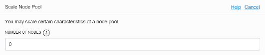

### [Содержание](../../README.md)

### [Назад: 6. Работа с кластером Kubernetes](p6.md)

# 7. Завершение и очистка

Далее приведены основные сервисы и ресурсы, которые были созданы во время практикума и которые рекомендуется удалить или остановить, если они больше не нужны, чтобы не происходило списание средств за их работу.

Если вы собираетесь дальше работать с этими ресурсами, то удалять их не нужно. Активные ресурсы можно остановить.

### 7.1. Удаление pod и сервисов
Удалите pod и сервисы, включая балансировщик нагрузки.

```bash
$ kubectl delete -f $HOME/workshop/clouddemo-micro/kube/clouddemo-micro.yaml
```

```bash
$ kubectl delete -f $HOME/workshop/clouddemo-micro/kube/clouddemo-micro-lb.yaml
```

Эта операция обратима: можно опять применить файлы yaml командой **kubectl apply**.

### 7.2. Остановка или удаление кластера
 
Если вы хотите остановить кластер, но не удалять его,пролистайте ниже до раздела Node Pools и нажмите **Actions / Scale**.

В появившемся окне установите в поле Number of Nodes значение, равное 0. Пролистайте ниже и нажмите Scale.

В результате рабочие узлы будут удалены, но кластер останется активным. Все Pod будут переведены в состояние Pending.

Если кластер понадобится снова, то увеличьте количество узлов до требуемого. Как только новые узлы будут созданы, кластер заработает и pod будут запущены на новых узлах.

Если кластер больше не нужен, его можно удалить. **Эта операция необратима**.

При удалении кластера удаляются также Node Pools и узлы кластера (если они не были удалены ранее).


Нажмите **Delete Cluster**. 
Если удалить кластер, не удалив предварительно сервисы, то созданный балансировщик нагрузки автоматически не удаляется.

### 7.3. Удаление загруженных файлов из Object Storage

Удалите содержимое хранилища Object Storage, созданное программой, если оно больше не нужно. **Эта операция необратима**.


**Buckets** можно удалять только после удаления их содержимого. Для этого нужно зайти в каждый Bucket, выделить все загруженные файлы и удалить их.

### 7.4. Остановка или удаление автономной базы данных

Если база данных не используется, ее можно остановить, нажав **Stop**. При этом приложение в кластере (если он не удален) перестанет работать. Если приложение снова потребуется, перед началом работы снова запустите базу данных, нажав **Start**.

Если база больше не нужна, ее можно остановить **Эта операция необратима**.

Для удаления базы данных нажмите **Terminate** в окне детальной информации о базе данных.

### 7.5. Удаление балансировщика нагрузки

Перейдите в меню **Networking / Load Balancers**.

Если вы не удалили сервис командой `kubectl delete ...`, то можно удалить балансировщик нагрузки здесь.

Эта операция необратима.

### 7.6. Удаление виртуальной сети

Перейдите в меню **Networking / Virtual Cloud Networks**.

Удалить виртуальную сеть можно здесь. Однако удаление сети возможно только в том случае, если в ней отсутствуют ресурсы: балансировщик, виртуальные машины, кластеры и т.д.

Эта операция необратима.

### 7.7. Удаление пользователя

Перейдите в меню **Identity / Users**.

Перед удалением пользователя необходимо удалить его из всех групп.

Эта операция необратима.

### 7.8. Удаление репозиториев Docker

Перейдите в меню **Developer Services / Registry (OCIR)**. Здесь можно удалить каждый репозиторий.

Эта операция необратима.

### Спасибо вам за участие в практикуме!

По всем вопросам, касающимся практикума, а также облачных сервисов Oracle, можете обращаться:

**Андрей Непомнящий**, старший инженер по решениям, Oracle Digital


### [Назад: 6. Работа с кластером Kubernetes](p6.md)