Добро пожаловать на Oracle Cloud Kubernetes&Microservices Hands-On
Workshop!

Содержание {#содержание .TOC-Heading}
==========

[1. Вводная часть 3](#вводная-часть)

[1.1. Цель практикума 3](#цель-практикума)

[1.2. Архитектура приложения 4](#архитектура-приложения)

[2. Подготовка 4](#подготовка)

[2.1. Перед практикумом 4](#перед-практикумом)

[2.2. Доступ к облаку Oracle 4](#доступ-к-облаку-oracle)

[2.3. Запуск Cloud Shell 6](#запуск-cloud-shell)

[2.4. Создание пользователя для доступа к API
6](#создание-пользователя-для-доступа-к-api)

[2.5. Создание конфигурации OCI CLI 8](#создание-конфигурации-oci-cli)

[2.6. Создание автономной базы данных
11](#создание-автономной-базы-данных)

[2.1. Получение реквизитов для безопасного доступа к базе данных
12](#получение-реквизитов-для-безопасного-доступа-к-базе-данных)

[2.2. Создание пользователей и таблиц
12](#создание-пользователей-и-таблиц)

[3. Запуск микросервисного приложения
14](#запуск-микросервисного-приложения)

[3.1. Создание токена для подключения к Docker репозиторию
14](#создание-токена-для-подключения-к-docker-репозиторию)

[3.2. Подключение к Docker репозиторию
15](#подключение-к-docker-репозиторию)

[3.3. Загрузка приложения 15](#загрузка-приложения)

[3.1. Добавление в приложение информации для доступа к базе данных и OCI
CLI
15](#добавление-в-приложение-информации-для-доступа-к-базе-данных-и-oci-cli)

[3.2. Создание кластера Kubernetes 16](#создание-кластера-kubernetes)

[3.3. Подключение к кластеру Kubernetes
17](#подключение-к-кластеру-kubernetes)

[3.4. Подключение кластера Kubernetes к Docker репозиторию
18](#подключение-кластера-kubernetes-к-docker-репозиторию)

[3.5. Подготовка конфигурации кластера
18](#подготовка-конфигурации-кластера)

[3.6. Запуск контейнеров и сетевых сервисов в кластере Kubernetes
18](#запуск-контейнеров-и-сетевых-сервисов-в-кластере-kubernetes)

[3.7. Сборка Docker-контейнеров с микросервисным приложением
18](#сборка-docker-контейнеров-с-микросервисным-приложением)

[3.8. Выгрузка созданные контейнеры в Docker репозиторий.
19](#выгрузка-созданные-контейнеры-в-docker-репозиторий.)

[3.9. Пример быстрого обновления контейнера
20](#пример-быстрого-обновления-контейнера)

[3.10. История развертывания и откат к предыдущей версии
22](#история-развертывания-и-откат-к-предыдущей-версии)

[3.11. Масштабирование кластера 23](#масштабирование-кластера)

[3.12. Завершение и очистка 23](#завершение-и-очистка)

Вводная часть
=============

Цель практикума
---------------

Спасибо за участие в практикуме Oracle Cloud!

Во время практикума вы получите практические навыки по работе облачной
инфраструктурой Oracle, виртуальными машинами, сетевой облачной
инфраструктурой, автономной транзакционной базой Oracle, а также
сервисами для разработчиков: Docker репозиторием и кластерами
Kubernetes.

Благодаря облачной инфраструктуре Oracle и полученным навыкам вы сможете
развертывать отказоустойчивые масштабируемые приложения в кластерах
Kubernetes и виртуальных машинах, сможете создавать резервную
инфраструктуру в облаке и повысить надежность своих информационных
систем. Навыки работы с контейнерами помогут вам ускорить запуск,
интеграцию и развертывание своих приложений.

В качестве примера для развертывания в облачной инфраструктуре Oracle
будет использовано приложение, написанное на Oracle Visual Builder (на
базе Javascript компонентов Oracle Jet), и на Python с использованием
компонентов cx\_Oracle для доступа к СУБД Oracle и открытых библиотек
Tesseract.

Приложение позволяет загружать изображения (в качестве хранилища
используется Oracle Cloud Object Storage), которые затем распознаются, а
распознанный текст сохраняется в автономной базе данных Oracle. После
распознавания из последних 10 распознанных файлов формируется «облако
слов» с наиболее часто встречающимися в тексте словами. Эти 10 последних
файлов вместе с облаком слов отображаются в приложении.

Во время практикума будет создана требуемая для запуска приложения
инфраструктура в облаке Oracle, приложение в «монолитном» варианте будет
запущено в Docker контейнерах, работающих на виртуальной машине.

Затем будет создан кластер Kubernetes в облаке Oracle, и приложение
будет запущено в этом кластере в «микросервисном» варианте.

Архитектура приложения
----------------------

{width="7.268055555555556in" height="5.381944444444445in"}

Подготовка
==========

Перед практикумом
-----------------

Необходимо базовое знание командной строки Linux, понимание
терминологии, используемой в облачных технологиях.

Доступ к облаку Oracle
----------------------

Прежде чем приступать к практикуму, убедитесь, что у вас имеется доступ
к облаку Oracle (например, активированный Trial), учетная запись не
заблокирована и пароль к ней не утрачен.

При создании учетной записи рекомендуется использовать регион **Germany
Central (Frankfurt)**. Некоторые действия в данном практикуме
предполагают использование этого региона.

Если вы при создании учетной записи выбрали другой регион, то обратитесь
за помощью к инструктору.

Для работы вам потребуется интернет-браузер. Рекомендуется отключить
расширения браузера, влияющие на содержимое (например, блокировщики
рекламы и анонимайзеры).

{:width="4.7352941819772525in" height="1.1431649168853892in"}

Зайдите на сайт oracle.com, нажмите View Accounts, а затем Sign in to
Cloud (На других языках надписи будут различаться).

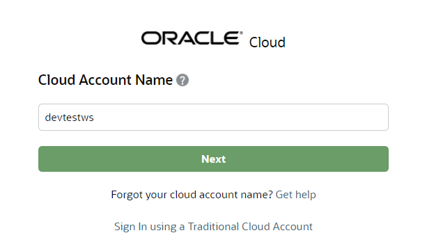{:width="2.2395833333333335in" height="1.3078707349081364in"}

Введите имя аккаунта, которое было задано при создании учетной записи, и
нажмите Next.

Если вы не знаете имя аккаунта, вернитесь к п. 2.2

{:width="2.5569444444444445in" height="2.0416666666666665in"}

Введите имя и пароль учетной запись Oracle Cloud.

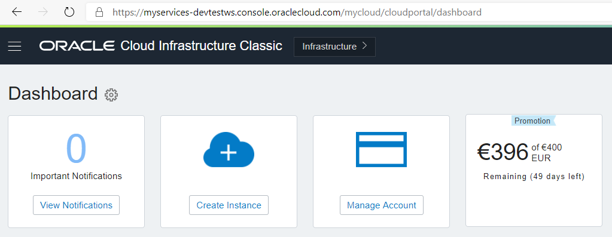{:width="3.3986111111111112in" height="1.3180555555555555in"}
Вы попадете на приборную панель облака Oracle.

Здесь вы можете проверить остаток средств на балансе, увидеть сводку по
используемым сервисам и т.д.

Чтобы перейти в консоль управления инфраструктурой, нажмите на кнопку
Infrastructure. Возможно, потребуется еще раз ввести имя аккаунта и
нажать Next.

Также, если вы ранее уже открывали консоль управления инфраструктурой,
можно пройти по прямой ссылке:
<https://console.eu-frankfurt-1.oraclecloud.com/a/compute/instances>

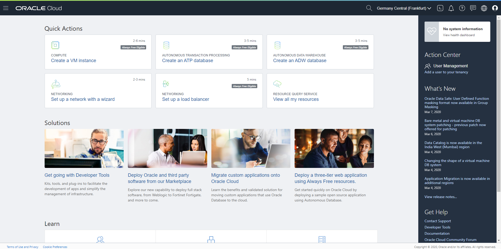{width="4.7340277777777775in"
height="2.3620384951881013in"}

Запуск Cloud Shell
------------------

{width="2.326388888888889in"
height="0.3694083552055993in"}Нажмите на кнопку запуска Cloud Shell
рядом с названием региона (справа вверху).

{width="4.7340277777777775in"
height="2.3855588363954507in"}Будет запущен Cloud Shell в том же самом
окне браузера.

Cloud Shell -- это встроенная консоль для работы с Oracle Cloud
Infrastructure. Она доступна из любого браузера и не требует установки
дополнительного ПО.

Размер домашней папки пользователя, которая сохраняется даже при
неработающем Cloud Shell, составляет 5 ГБ. Эта папка будет удалена при
неиспользовании Cloud Shell более 6 месяцев.

В состав ПО, установленного в Cloud Shell, входит клиент командной
строки OCI CLI, docker, kubectl, sqlplus, terraform, ansible и ряд
другого ПО.

Cloud Shell имеет доступ в Интернет, но к консоли Cloud Shell нельзя
подключиться извне по ssh.

Доступ к правам суперпользователя не предоставляется.

**Для доступа к Clipboard в Cloud Shell используются следующие сочетания
клавиш:**

-   **Ctrl-Insert -- Скопировать**

-   **Shift-Insert -- Вставить**

Создание пользователя для доступа к API
---------------------------------------

Пролистайте главное меню вниз и выберите раздел Identity / Users

{width="1.860913167104112in"
height="3.381502624671916in"}

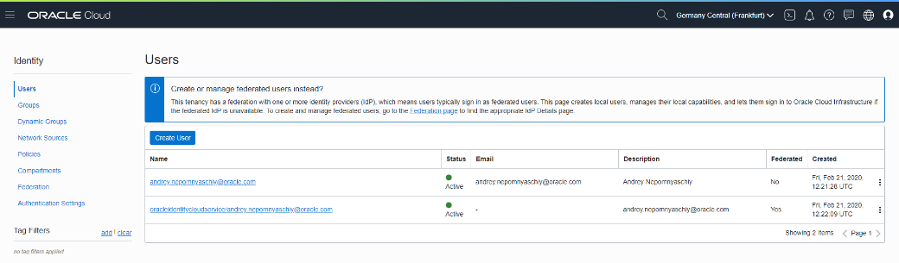{width="4.722542650918635in"
height="1.3852668416447944in"}В меню пользователей нажмите Create User

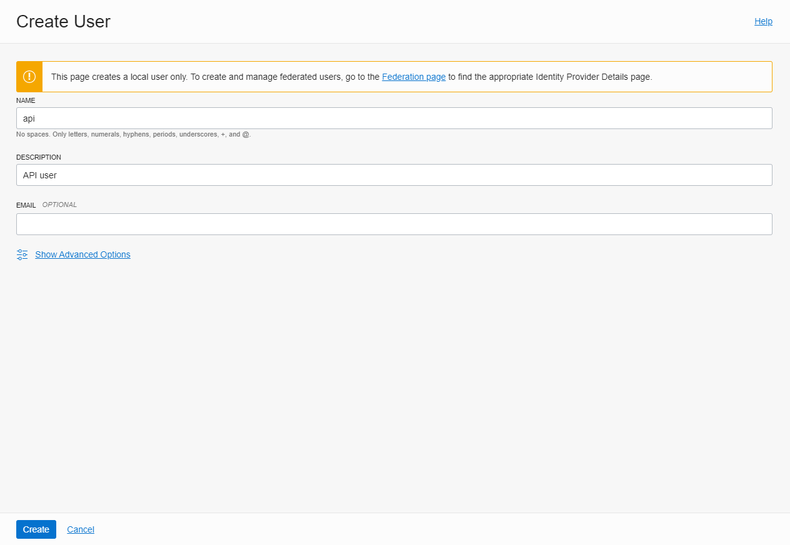{width="3.6994214785651796in"
height="2.558066491688539in"}В меню создания пользователя введите имя:
**api**, описание пользователя (например, API User) и нажмите
**Create**.

Нажмите на созданного пользователя api и в появившемся окне детальной
информации о пользователе внизу нажмите **Groups**.

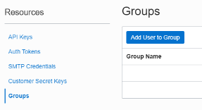{width="1.3063582677165355in"
height="0.7086253280839895in"} **Нажмите Add User to Groups**

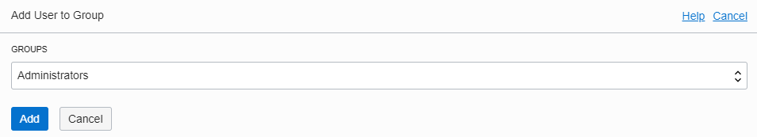{width="4.494250874890638in"
height="0.8150284339457567in"} В появившемся окне выберите
**Administrators** и нажмите **Add**.

Создание конфигурации OCI CLI
-----------------------------

После окончания установки OCI CLI выполните команду создания
конфигурации:

andrey\_nep\@cloudshell:\~ (eu-frankfurt-1)\$ **oci setup config**

This command provides a walkthrough of creating a valid CLI config file.

\...

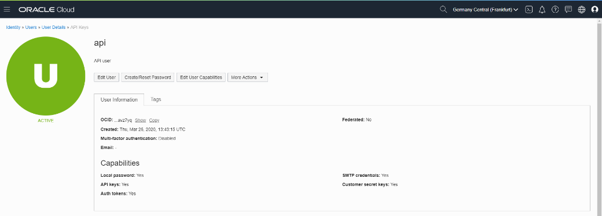{width="4.728323490813648in"
height="1.6991426071741031in"} Вам потребуется User OCID. Для его
получения перейдите в детальную информацию пользователя api и скопируйте
его OCID, нажав на Copy (чтобы просмотреть OCID, нажмите Show)

Вставьте значение OCID в ответ на запрос из предыдущей команды.

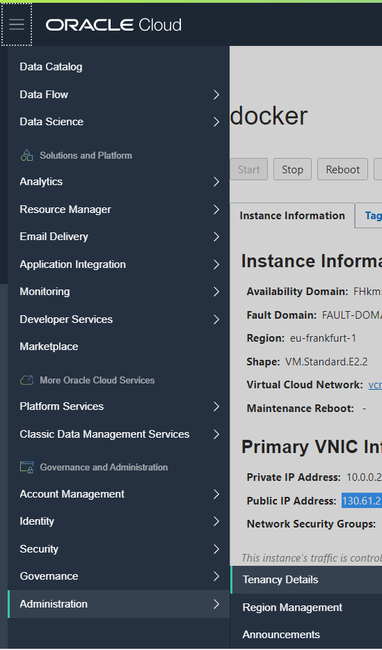{width="1.9131944444444444in"
height="3.254861111111111in"}Далее вам потребуется OCID вашего аккаунта
(Tenancy OCID).

Для его получения пролистайте боковое меню до конца, выберите пункт
Administration и далее Tenancy Details.

{width="3.612295494313211in"
height="2.1354166666666665in"}В разделе информации о Tenancy скопируйте
OCID и вставьте его в ответ на запрос.

Далее программа установки запросит ваш регион. Введите
**eu-frankfurt-1**

Программа установки предложит сгенерировать ключ для доступа к OCI CLI.
Оставьте параметры и пути без изменения, нажав несколько раз Enter.

\...

Private key written to: /home/andrey\_nep/.oci/oci\_api\_key.pem

Fingerprint: cc:a1:3d:a9:27:d1:4c:7e:09:50:7c:2d:0e:af:9a:0a

Config written to /home/andrey\_nep/.oci/config

If you haven\'t already uploaded your public key through the console,

follow the instructions on the page linked below in the section \'How to

upload the public key\':

https://docs.cloud.oracle.com/Content/API/Concepts/apisigningkey.htm\#How2

Далее необходимо создать API Key для доступа к OCI.

В предыдущем пункте программа установки сохранила публичный ключ. По
умолчанию путь его местонахождения
**/home/andrey\_nep/.oci/oci\_api\_key\_public.pem**

Скопируйте содержимое этого файла после выполнения команды:

andrey\_nep\@cloudshell:\~ (eu-frankfurt-1)\$ **cat
/home/andrey\_nep/.oci/oci\_api\_key\_public.pem**

\-\-\-\--BEGIN PUBLIC KEY\-\-\-\--

MIIBIjANBgkqhkiG9w0BAQEFAAOCAQ8AMIIBCgKCAQEApwLrzvzWtmAqxCxj2KCd

\...

ZQcXU+6XyUFcyfSZ9K1savuva3NEr0b9PkKtigv/WQDFSd8HsTtiN2ASebV7RAlq

SQIDAQAB

\-\-\-\--END PUBLIC KEY\-\-\-\--

В меню пользователя внизу выберите API Keys.

{width="4.710982064741907in"
height="2.317230971128609in"}

Нажмите Add Public Key

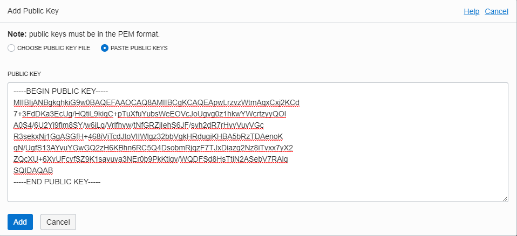{width="2.3468208661417322in"
height="1.072729658792651in"} В окне добавления ключа выберите пункт
Paste public keys и вставьте содержимое публичного ключа и нажмите Add.

Обратите внимание, что Fingerprint созданного ключа должен совпадать с
Fingerprint, выданный программой установки на предыдущем этапе.

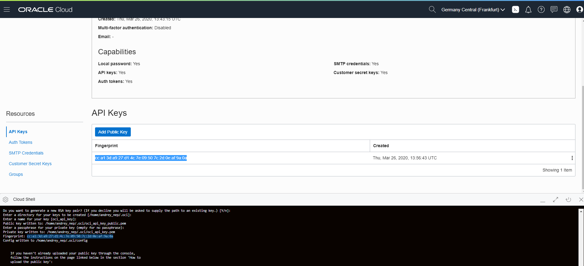{width="4.705202318460192in"
height="2.1493952318460194in"}

Проверить работу CLI можно командой:

andrey\_nep\@cloudshell:\~ (eu-frankfurt-1)\$ oci os ns get

{

\"data\": \"frxhexdipnsp\"

}

Результат этой команды -- json, содержащий в поле "data" название вашего
**namespace** (оно будет использовано в дальнейшем).

Выделить значение namespace из json можно командой jq:

andrey\_nep\@cloudshell:\~ (eu-frankfurt-1)\$ **oci os ns get \|jq
\".data\"**

\"frxhexdipnsp\"

Это значение используется в дальнейшем во многих командах. Чтобы каждый
раз не вводить его, создадим переменную **NAMESPACE**.

andrey\_nep\@cloudshell:\~ (eu-frankfurt-1)\$ **export
NAMESPACE=frxhexdipnsp**

andrey\_nep\@cloudshell:\~ (eu-frankfurt-1)\$ **echo \"export
NAMESPACE=frxhexdipnsp\" \>\> \~/.bashrc**

Замените на ваше значение **namespace**.

Для Solution Engineers: если вы используете namespace cloudstarscee, то
добавьте к названию namescpace /\<название города\>/\<ваше имя и первые
две буквы фамилии\>, например: **cloudstarscee/moscow/ane**

Это позволит избежать перезаписи ваших образов другими SE, а также
разделить образы по городам.

Конфигурация OCI CLI и ключи сохранены в папке **\$HOME/.oci**

Необходимо отредактировать файл **\$HOME/.oci/config**, чтобы исправить
путь, который будет использоваться в дальнейшем в Docker контейнерах.

Выполните следующую команду:

andrey\_nep\@cloudshell:\~ (eu-frankfurt-1)\$ **sed -i -e
\'s/\^key\_file.\*/key\_file=\\/home\\/opc\\/.oci\\/oci\_api\_key.pem/\'
\$HOME/.oci/config**

Создание автономной базы данных
-------------------------------

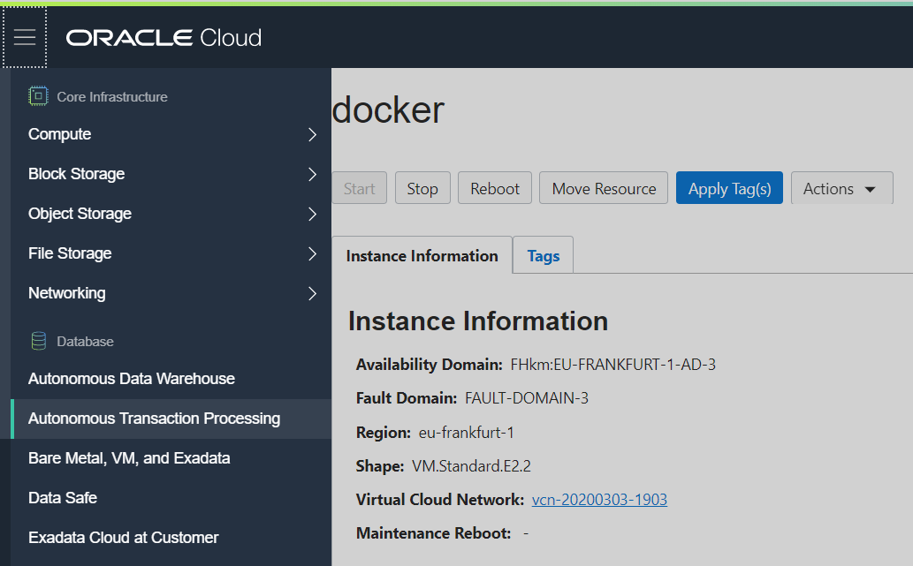{width="3.730392607174103in"
height="2.3146555118110235in"}Перейдите из бокового меню в раздел
Autonomous Transaction Processing и нажмите Create Autonomous Database.

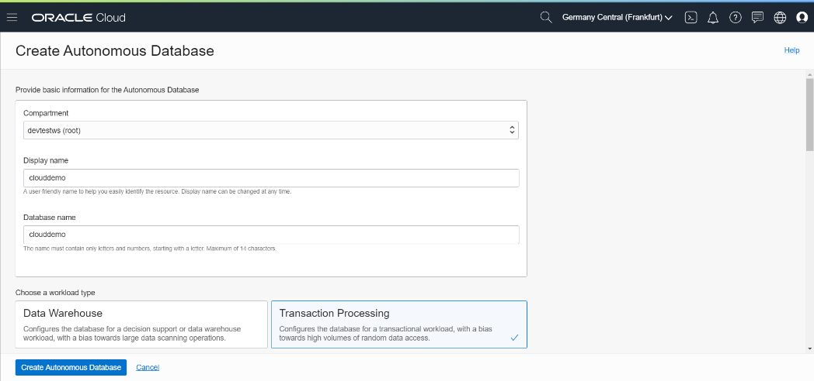{width="4.763194444444444in"
height="2.238888888888889in"}Введите имя базы данных. Рекомендуется
использовать **clouddemo**, отображаемое имя **clouddemo**, т.к. эти
наименования используются в дальнейшем.

Убедитесь, что тип нагрузки выбран Transaction Processing.

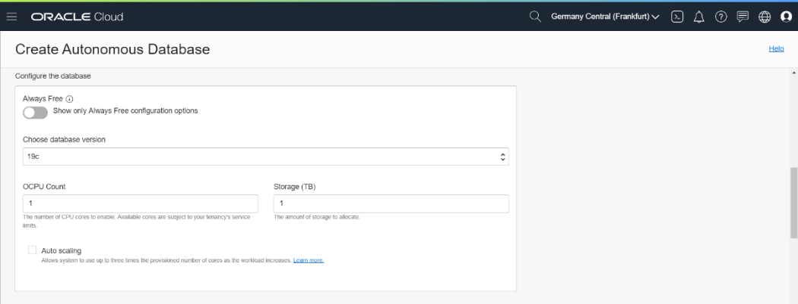{width="4.770833333333333in"
height="1.8291666666666666in"}Пролистайте ниже и введите параметры
создаваемой базы данных.

Для практикума нам достаточно 1 OCPU (ядра) и 1 ТБ хранилища.

Auto scaling не потребуется.

{width="4.7444444444444445in"
height="2.0722222222222224in"}

Введите пароль администратора базы данных и сохраните его в безопасном
месте.

Для практикума параметры сетевого доступа можно оставить по умолчанию.

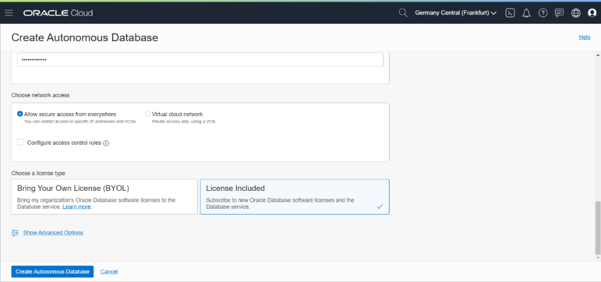{width="4.723611111111111in"
height="2.222916666666667in"}

По правилам лицензирования базы данных вы должны выбрать пункт License
Included.

Нажмите Create Autonomous Database. Создание автономной базы данных
займет 1-2 минуты.

Получение реквизитов для безопасного доступа к базе данных
----------------------------------------------------------

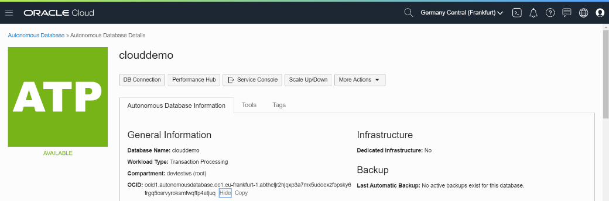{width="4.722222222222222in"
height="1.5652001312335957in"}Перейдите в консоль управления автономной
базой данных и скопируйте ее OCID

В консоли Cloud Shell выполните команду (вставьте скопированный OCID
автономной базы данных после \--autonomous-database-id).

andrey\_nep\@cloudshell:\~ (eu-frankfurt-1)\$ **mkdir workshop && cd
workshop**

andrey\_nep\@cloudshell:workshop (eu-frankfurt-1)\$ **oci db
autonomous-database generate-wallet \--autonomous-database-id \<paste
ADB OCID here\> \--file wallet.zip \--password mypassword1
\--generate-type SINGLE**

Downloading file
\[\#\#\#\#\#\#\#\#\#\#\#\#\#\#\#\#\#\#\#\#\#\#\#\#\#\#\#\#\#\#\#\#\#\#\#\#\]
100%

andrey\_nep\@cloudshell:workshop (eu-frankfurt-1)\$ **ls**

wallet.zip

В результате будет создана папка workshop и сгенерирован wallet для
безопасного доступа к автономной базе данных. Этот файл (wallet.zip) нам
потребуется позднее.

Создание пользователей и таблиц
-------------------------------

Распакуйте созданный wallet.zip в папку .wallet:

andrey\_nep\@cloudshell:workshop (eu-frankfurt-1)\$ **unzip wallet.zip
-d \$HOME/.wallet**

Archive: wallet.zip

inflating: /home/andrey\_nep/.wallet/cwallet.sso

inflating: /home/andrey\_nep/.wallet/tnsnames.ora

inflating: /home/andrey\_nep/.wallet/readme.md

inflating: /home/andrey\_nep/.wallet/truststore.jks

inflating: /home/andrey\_nep/.wallet/ojdbc.properties

inflating: /home/andrey\_nep/.wallet/sqlnet.ora

inflating: /home/andrey\_nep/.wallet/ewallet.p12

inflating: /home/andrey\_nep/.wallet/keystore.jks

andrey\_nep\@cloudshell:workshop (eu-frankfurt-1)\$ **ls
\$HOME/.wallet**

cwallet.sso ewallet.p12 keystore.jks ojdbc.properties readme.md
sqlnet.ora tnsnames.ora truststore.jks

Теперь нужно создать переменную TNS\_ADMIN, которая будет указывать на
папку с wallet.

andrey\_nep\@cloudshell:workshop (eu-frankfurt-1)\$ **export
TNS\_ADMIN=\$HOME/.wallet**

andrey\_nep\@cloudshell:workshop (eu-frankfurt-1)\$ **echo \"export
TNS\_ADMIN=\$HOME/.wallet\" \>\> \~/.bashrc**

Вторая команда необходима, чтобы переменная сохранялась при перезапуске
Cloud Shell.

Отредактируйте файл sqlnet.ora, чтобы он указывал на расположение
.wallet.

andrey\_nep\@cloudshell:workshop (eu-frankfurt-1)\$ **nano
\$HOME/.wallet/sqlnet.ora**

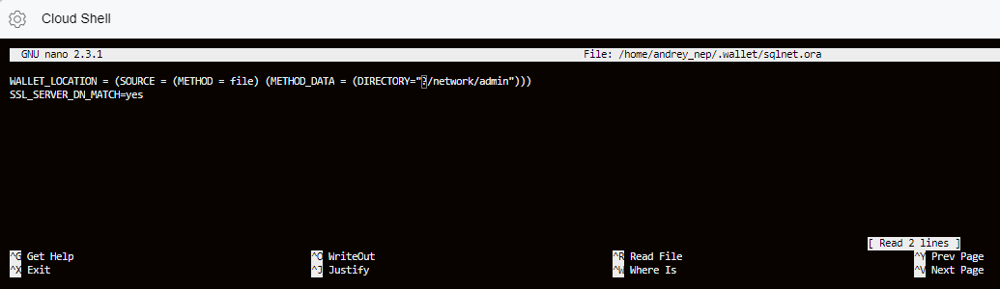{width="4.710982064741907in"
height="1.3652220034995626in"}

Вставьте в поле DIRECTORY значение \$TNS\_ADMIN.

До замены:

WALLET\_LOCATION = (SOURCE = (METHOD = file) (METHOD\_DATA =
(DIRECTORY=\"?/network/admin\")))

После замены:

WALLET\_LOCATION = (SOURCE = (METHOD = file) (METHOD\_DATA =
(DIRECTORY=\"\$TNS\_ADMIN\")))

Сохраните файл (Ctrl-O, Enter). Выход из nano (Ctrl-X).

Теперь запустите sqlplus и подключитесь к автономной базе данных
clouddemo от имени администратора. Введите пароль администратора,
который вы указывали при создании базы данных.

andrey\_nep\@cloudshell:workshop (eu-frankfurt-1)\$ **sqlplus
admin\@clouddemo\_tp**

SQL\*Plus: Release 19.0.0.0.0 - Production on Thu Mar 26 08:17:47 2020

Version 19.5.0.0.0

Copyright (c) 1982, 2019, Oracle. All rights reserved.

Enter password:

Last Successful login time: Wed Mar 25 2020 15:15:32 +00:00

Connected to:

Oracle Database 18c Enterprise Edition Release 18.0.0.0.0 - Production

Version 18.4.0.0.0

SQL\>

Выполните в sqlplus следующие команды:

create user demo identified by **myWSPassword\_01**;

grant create session, resource to demo;

grant unlimited tablespace to demo;

где **myWSPassword\_01** замените на ваш пароль пользователя demo.

Пароль должен содержать английские прописные и строчные буквы, как
минимум одну цифру и специальный символ.

Выйдите из sqlplus:

SQL\> quit

Disconnected from Oracle Database 18c Enterprise Edition Release
18.0.0.0.0 - Production

Version 18.4.0.0.0

Теперь зайдите в sqlplus и подключитесь к автономной базе данных
clouddemo от имени пользователя demo:

andrey\_nep\@cloudshell:workshop (eu-frankfurt-1)\$ **sqlplus
admin\@clouddemo\_tp**

Введите пароль, который вы указывали при создании пользователя demo.

Выполните в sqlplus команду для создания таблицы:

CREATE TABLE \"DEMO\".\"OCR\"

( \"ID\" NUMBER GENERATED BY DEFAULT ON NULL AS IDENTITY ,

\"HOSTNAME\" VARCHAR2(127 BYTE),

\"FILENAME\" VARCHAR2(255 BYTE),

\"STARTTIME\" DATE,

\"ENDTIME\" DATE,

\"DURATION\" NUMBER(7,2),

\"FINISHED\" NUMBER(2,0),

\"TEXT\" VARCHAR2(32000 BYTE),

\"TOKEN\" VARCHAR2(64 BYTE),

\"LINK\" VARCHAR2(1024 BYTE),

\"IPADDR\" VARCHAR2(256 BYTE),

\"USERAGENT\" VARCHAR2(256 BYTE)

);

Выйдите из sqlplus:

SQL\> quit

Запуск микросервисного приложения
=================================

Создание токена для подключения к Docker репозиторию
----------------------------------------------------

Войдите в меню пользователя **api** (Identity / Users).

Пролистайте ниже и выберите слева внизу Auth Tokens

Нажмите Generate Token и введите имя токена.

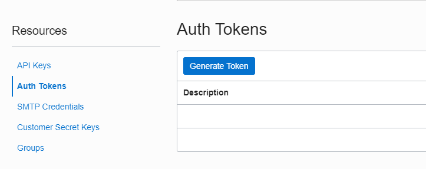{width="2.531791338582677in"
height="1.0048786089238846in"}

{width="3.0145833333333334in"
height="0.6944444444444444in"}Нажмите Generate Token.

Будет сгенерирован токен.

{width="2.826388888888889in"
height="0.8229166666666666in"}Токен отображается только один раз!
Скопируйте его и сохраните, например, в текстовом редакторе.

Альтернативно вы можете использовать команду CLI для генерации токена:

andrey\_nep\@cloudshell:workshop (eu-frankfurt-1)\$ **oci iam auth-token
create \--user-id \<paste User OCID here\> \--description workshop \|jq
\".data.token\"**

Вставьте в команду OCID пользователя **api**.

В результате будет сгенерирован токен с именем workshop и отображен в
выводе команды. Токен можно скопировать и использовать в качестве пароля
при подключении к Docker репозиторию.

Подключение к Docker репозиторию
--------------------------------

Выполните следующие команды:

andrey\_nep\@cloudshell:workshop (eu-frankfurt-1)\$ **docker login
fra.ocir.io -u \$NAMESPACE/api -p \"\<Paste Your Token Here\>\"**

WARNING! Using \--password via the CLI is insecure. Use
\--password-stdin.

WARNING! Your password will be stored unencrypted in
/home/andrey\_nep/.docker/config.json.

Configure a credential helper to remove this warning. See

https://docs.docker.com/engine/reference/commandline/login/\#credentials-store

Login Succeeded

В качестве пароля используйте токен, который был сгенерирован на
предыдущем шаге. Пароль должен быть заключен в кавычки, т.к. в нем могут
содержаться специальные символы.

В результате должен быть получен ответ: Login Succeeded. Убедитесь в
этом, прежде чем приступать к следующему шагу.

Загрузка приложения
-------------------

Выполните следующие команды:

andrey\_nep\@cloudshell:workshop (eu-frankfurt-1)\$ **git clone
https://github.com/andreynepo/clouddemo-micro.git**

Добавление в приложение информации для доступа к базе данных и OCI CLI
----------------------------------------------------------------------

Выполните следующие команды:

andrey\_nep\@cloudshell:workshop (eu-frankfurt-1)\$ **unzip
\$HOME/workshop/wallet.zip -d
\$HOME/workshop/clouddemo-micro/clouddemo-db/docker/context/.wallet/**

Archive: /home/opc/workshop/wallet.zip

inflating:
/home/opc/workshop/clouddemo-micro/clouddemo-db/docker/context/.wallet/cwallet.sso

inflating:
/home/opc/workshop/clouddemo-micro/clouddemo-db/docker/context/.wallet/readme.md

inflating:
/home/opc/workshop/clouddemo-micro/clouddemo-db/docker/context/.wallet/tnsnames.ora

inflating:
/home/opc/workshop/clouddemo-micro/clouddemo-db/docker/context/.wallet/truststore.jks

inflating:
/home/opc/workshop/clouddemo-micro/clouddemo-db/docker/context/.wallet/ojdbc.properties

inflating:
/home/opc/workshop/clouddemo-micro/clouddemo-db/docker/context/.wallet/sqlnet.ora

inflating:
/home/opc/workshop/clouddemo-micro/clouddemo-db/docker/context/.wallet/ewallet.p12

inflating:
/home/opc/workshop/clouddemo-micro/clouddemo-db/docker/context/.wallet/keystore.jks

Если скопировать папку \$HOME/.wallet, а не распаковать wallet.zip, то
при запуске контейнера будет выдана ошибка, т.к. мы исправляли данные
расположения в sqlnet.ora

andrey\_nep\@cloudshell:workshop (eu-frankfurt-1)\$ **cp -rp \$HOME/.oci
\$HOME/workshop/clouddemo-micro/clouddemo-api/docker/context/**

Отредактируйте файл api.py и убедитесь, что данные имени пользователя и
пароля актуальны.

andrey\_nep\@cloudshell:workshop (eu-frankfurt-1)\$ **nano
\$HOME/workshop/clouddemo-micro/clouddemo-db/docker/context/app/db.py**

При необходимости откорректируйте значения.

dbuser=\"demo\"

dbpw=\"myWSPassword\_01\"

connstr=\"clouddemo\_tp\"

Создание кластера Kubernetes
----------------------------

{width="2.765277777777778in"
height="2.0868055555555554in"}Откройте в боковом меню **Developer
Services** / **Container Clusters**

В открывшемся окне управления кластерами Kubernetes нажмите **Create
Cluster**

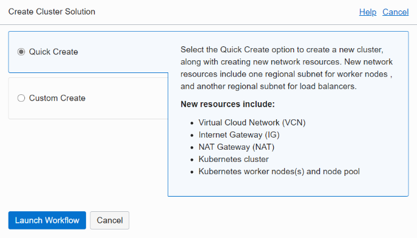{width="3.108888888888889in"
height="1.7760411198600174in"}Выберите **Quick Create** и нажмите
**Launch Workflow**

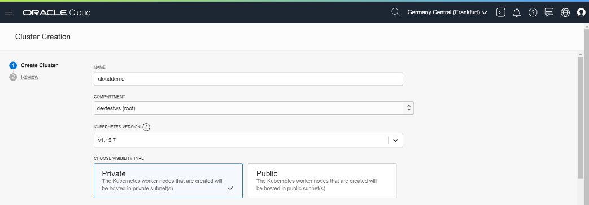{width="4.738888888888889in"
height="1.6531321084864392in"}

Выберите параметры создаваемого кластера:

Имя (например, **clouddemo**).

Версию Kubernetes: например, последнюю доступную.

Выберите **Private**, чтобы рабочие узлы не были доступны извне.

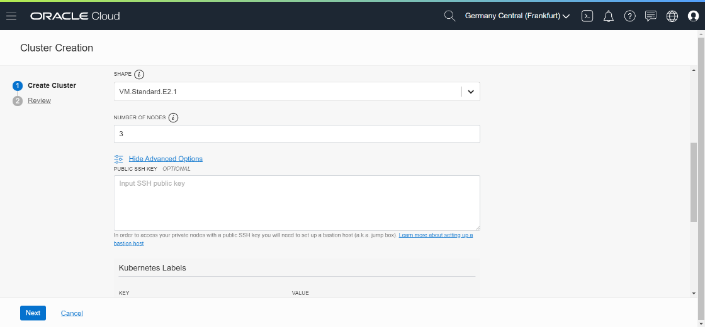{width="4.739583333333333in"
height="2.2041666666666666in"}

Пролистайте ниже и выберите конфигурацию виртуальных машин рабочих
узлов.

Рекомендуется **VM.Standard.E2.1**

Количество узлов: **3**

Нажмите **Show Advanced Options** и вставьте ваш публичный ключ ssh
(если в дальнейшем вам нужно будет подключиться к рабочим узлам по ssh).

Остальные опции можно оставить без изменений.

Нажмите **Next** для запуска процесса создания кластера Kubernetes.

Создание кластера и 3 рабочих узлов занимает 5-7 минут.

При создании кластера вы управляете только рабочими узлами.
Отказоустойчивые мастер-узлы управляются Oracle.

Когда мастер-узлы будут созданы, вы уже можете подключаться к кластеру.

Подключение к кластеру Kubernetes
---------------------------------

Нажмите **Access Cluster** и следуйте инструкциям.

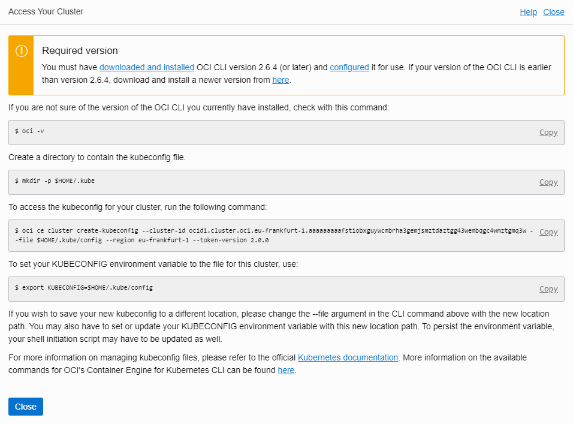{width="4.040462598425197in"
height="2.9880741469816274in"}

Скопируйте из открывшегося окна и выполните следующие команды:

andrey\_nep\@cloudshell:workshop (eu-frankfurt-1)\$ **mkdir -p
\$HOME/.kube**

andrey\_nep\@cloudshell:workshop (eu-frankfurt-1)\$ **oci ce cluster
create-kubeconfig \--cluster-id
ocid1.cluster.oc1.eu-frankfurt-1.aaaaaaaaafstiobxguywcmbrha3gemjsmztdaztgg43wembqgc4wmztgmq3w
\--file \$HOME/.kube/config \--region eu-frankfurt-1 \--token-version
2.0.0**

New config written to the Kubeconfig file /home/andrey\_nep/.kube/config

Подключение кластера Kubernetes к Docker репозиторию
----------------------------------------------------

Выполните команду:

andrey\_nep\@cloudshell:workshop (eu-frankfurt-1)\$ **kubectl create
secret generic regcred
\--from-file=.dockerconfigjson=\$HOME/.docker/config.json
\--type=kubernetes.io/dockerconfigjson**

secret/regcred created

Эта команда создает из конфигурации Docker (которую мы создавали
командой docker login) аналогичную конфигурацию Kubernetes.

Теперь кластер Kubernetes сможет загружать контейнеры из нашего Docker
репозитория.

Подготовка конфигурации кластера 
--------------------------------

Перейдите в консоль ssh виртуальной машины.

Необходимо подставить в файлы настроек Kubernetes значение namespace.
Выполните команды:

andrey\_nep\@cloudshell:workshop (eu-frankfurt-1)\$ **cd
clouddemo-micro**

andrey\_nep\@cloudshell:clouddemo-micro (eu-frankfurt-1)\$
**./replace\_namespace.sh \$NAMESPACE**

Replacing Namespace value\...

Запуск контейнеров и сетевых сервисов в кластере Kubernetes
-----------------------------------------------------------

Сначала необходимо создать сетевые сервисы, включая балансировщик
нагрузки. Последний также отвечает за предоставление кластеру публичного
IP-адреса.

Выполните следующие команды:

andrey\_nep\@cloudshell:clouddemo-micro (eu-frankfurt-1)\$ **kubectl
apply -f kube/clouddemo-micro-lb.yaml**

service/front created

service/api created

service/db created

service/wc created

Проверьте, что все сервисы созданы и работают.

andrey\_nep\@cloudshell:clouddemo-micro (eu-frankfurt-1)\$ **kubectl get
service -o wide**

NAME TYPE CLUSTER-IP EXTERNAL-IP PORT(S) AGE SELECTOR

api NodePort 10.96.19.163 \<none\> 8080:30919/TCP 9m50s app=api

db NodePort 10.96.18.105 \<none\> 8080:31233/TCP 9m50s app=db

front LoadBalancer 10.96.177.69 **130.61.9.67** 80:32384/TCP 9m50s
app=front

kubernetes ClusterIP 10.96.0.1 \<none\> 443/TCP 62m \<none\>

wc NodePort 10.96.153.105 \<none\> 8080:31778/TCP 9m50s app=wc

Обратите внимание на внешний IP-адрес балансировщика. Если он находится
в состоянии \<pending\>, значит, балансировщик еще не создан. В этом
случае требуется подождать и повторить последнюю команду через некоторое
время.

Сборка Docker-контейнеров с микросервисным приложением
------------------------------------------------------

Выполните следующие команды:

andrey\_nep\@cloudshell:clouddemo-micro (eu-frankfurt-1)\$ **docker
build -t fra.ocir.io/\$NAMESPACE/clouddemo-micro/front
clouddemo-front/docker/**

andrey\_nep\@cloudshell:clouddemo-micro (eu-frankfurt-1)\$ **docker
build -t fra.ocir.io/\$NAMESPACE/clouddemo-micro/api
clouddemo-api/docker/**

andrey\_nep\@cloudshell:clouddemo-micro (eu-frankfurt-1)\$ **docker
build -t fra.ocir.io/\$NAMESPACE/clouddemo-micro/db
clouddemo-db/docker/**

andrey\_nep\@cloudshell:clouddemo-micro (eu-frankfurt-1)\$ **docker
build -t fra.ocir.io/\$NAMESPACE/clouddemo-micro/wc
clouddemo-wc/docker/**

Должны быть без ошибок собраны 4 новых образа. Их можно посмотреть
следующей командой.

andrey\_nep\@cloudshell:clouddemo-micro (eu-frankfurt-1)\$ **docker
images**

REPOSITORY TAG IMAGE ID CREATED SIZE

fra.ocir.io/frxhexdipnsp/clouddemo-micro/wc latest a053353c1c0f About a
minute ago 307MB

fra.ocir.io/frxhexdipnsp/clouddemo-micro/db latest 32f6f6c5e236 About a
minute ago 330MB

fra.ocir.io/frxhexdipnsp/clouddemo-micro/api latest 366bd8f03330 2
minutes ago 352MB

fra.ocir.io/frxhexdipnsp/clouddemo-micro/front latest 419dceb70b9e 4
minutes ago 95MB

python 3.7-slim 69afd9568c9d 2 weeks ago 179MB

debian buster-slim 2f14a0fb67b9 4 weeks ago 69.2MB

Выгрузка созданные контейнеры в Docker репозиторий.
---------------------------------------------------

Выполните следующие команды:

andrey\_nep\@cloudshell:clouddemo-micro (eu-frankfurt-1)\$ **docker push
fra.ocir.io/\$NAMESPACE/clouddemo-micro/front**

andrey\_nep\@cloudshell:clouddemo-micro (eu-frankfurt-1)\$ **docker push
fra.ocir.io/\$NAMESPACE/clouddemo-micro/api**

andrey\_nep\@cloudshell:clouddemo-micro (eu-frankfurt-1)\$ **docker push
fra.ocir.io/\$NAMESPACE/clouddemo-micro/db**

andrey\_nep\@cloudshell:clouddemo-micro (eu-frankfurt-1)\$ **docker push
fra.ocir.io/\$NAMESPACE/clouddemo-micro/wc**

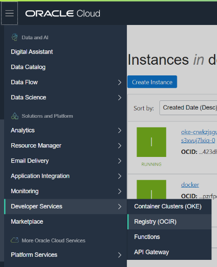{width="1.9354166666666666in"
height="2.3819444444444446in"}Выгруженные контейнеры можно посмотреть.
Для этого перейдите в меню Developer Services / Registry (OCIR).

{width="4.725489938757655in"
height="1.8958847331583553in"}Убедитесь, что все 4 образа успешно
выгружены.

Теперь можно запустить pod с нагрузкой.

andrey\_nep\@cloudshell:clouddemo-micro (eu-frankfurt-1)\$ **kubectl
apply -f kube/clouddemo-micro.yaml**

deployment.apps/api created

deployment.apps/front created

deployment.apps/db created

deployment.apps/wc created

Проверьте, что все pod создались и работают. Один из pod api находится в
состоянии ожидания.

andrey\_nep\@cloudshell:clouddemo-micro (eu-frankfurt-1)\$ **kubectl get
pods -o wide**

NAME READY STATUS RESTARTS AGE IP NODE NOMINATED NODE READINESS GATES

api-7679c7fb4b-hp6lf 1/1 Running 0 26s 10.244.2.6 10.0.10.3 \<none\>
\<none\>

api-7679c7fb4b-kz25v 0/1 Pending 0 26s \<none\> \<none\> \<none\>
\<none\>

api-7679c7fb4b-vw69q 1/1 Running 0 26s 10.244.0.8 10.0.10.2 \<none\>
\<none\>

api-7679c7fb4b-wqjjp 1/1 Running 0 26s 10.244.1.7 10.0.10.4 \<none\>
\<none\>

db-579b47b499-mzhk6 1/1 Running 0 26s 10.244.0.9 10.0.10.2 \<none\>
\<none\>

db-579b47b499-vjwj8 1/1 Running 0 26s 10.244.2.7 10.0.10.3 \<none\>
\<none\>

front-948cdff6d-8rnpr 1/1 Running 0 8m20s 10.244.0.5 10.0.10.2 \<none\>
\<none\>

front-948cdff6d-fn9xz 1/1 Running 0 8m20s 10.244.1.4 10.0.10.4 \<none\>
\<none\>

wc-59577c8b5f-6dxdf 1/1 Running 0 8m20s 10.244.1.6 10.0.10.4 \<none\>
\<none\>

wc-59577c8b5f-d5mv8 1/1 Running 0 8m20s 10.244.2.5 10.0.10.3 \<none\>
\<none\>

Теперь можно обратиться к приложению в кластере по IP-адресу
балансировщика нагрузки.

{width="4.730392607174103in"
height="2.4786428258967628in"}

Пример быстрого обновления контейнера
-------------------------------------

Сейчас для генерации облака слов используется стандартная сине-зеленая
цветовая схема.

Изменим цветовую схему для иллюстрации концепции быстрого развертывания
изменений в микросервисах.

Пометьте имеющийся Docker образ **wc** номером версии с цветом:

andrey\_nep\@cloudshell:clouddemo-micro (eu-frankfurt-1)\$ **docker tag
fra.ocir.io/\$NAMESPACE/clouddemo-micro/wc:latest
fra.ocir.io/\$NAMESPACE/clouddemo-micro/wc:1.0-green**

Отредактируйте файл, который генерирует облако слов.

andrey\_nep\@cloudshell:clouddemo-micro (eu-frankfurt-1)\$ **nano
\~/workshop/clouddemo-micro/clouddemo-wc/docker/context/app/wc.py**

Пролистайте до строки def genwordcloud (fulltext):

Раскомментируйте строку:

\# wordcloud.recolor (color\_func=color\_func, random\_state=3)

Эта команда вызывает функцию, изменяющую цвет облака слов.

Сохраните файл (в nano используйте сочетание клавиш Ctrl+O).

Выполните следующие команды:

andrey\_nep\@cloudshell:clouddemo-micro (eu-frankfurt-1)\$ **docker
build -t fra.ocir.io/\$NAMESPACE/clouddemo-micro/wc:1.0-red
clouddemo-wc/docker/**

Sending build context to Docker daemon 5.12kB

Step 1/10 : FROM python:3.7-slim

\...

Successfully built 90083ee72432

Successfully tagged fra.ocir.io/frxhexdipnsp/clouddemo-micro/wc:1.0-red

Можно посмотреть список образов:

andrey\_nep\@cloudshell:clouddemo-micro (eu-frankfurt-1)\$ **docker
images**

REPOSITORY TAG IMAGE ID CREATED SIZE

fra.ocir.io/frxhexdipnsp/clouddemo-micro/wc 1.0-red b123509b7992 7
seconds ago 307MB

fra.ocir.io/frxhexdipnsp/clouddemo-micro/api latest 8507fc1fd1a0 9
minutes ago 352MB

fra.ocir.io/frxhexdipnsp/clouddemo-micro/db latest 3f762664991b 27
minutes ago 330MB

fra.ocir.io/frxhexdipnsp/clouddemo-micro/wc 1.0-green a053353c1c0f 40
minutes ago 307MB

fra.ocir.io/frxhexdipnsp/clouddemo-micro/wc latest a053353c1c0f 40
minutes ago 307MB

fra.ocir.io/frxhexdipnsp/clouddemo-micro/front latest 419dceb70b9e 44
minutes ago 95MB

python 3.7-slim 69afd9568c9d 2 weeks ago 179MB

debian buster-slim 2f14a0fb67b9 4 weeks ago 69.2MB

Выполните следующие команды:

andrey\_nep\@cloudshell:clouddemo-micro (eu-frankfurt-1)\$ **docker push
fra.ocir.io/\$NAMESPACE/clouddemo-micro/wc**

The push refers to repository
\[fra.ocir.io/frxhexdipnsp/clouddemo-micro-wc\]

9130414ff7f5: Pushed

\...

andrey\_nep\@cloudshell:clouddemo-micro (eu-frankfurt-1)\$ **kubectl set
image deployment/wc
wc=fra.ocir.io/\$NAMESPACE/clouddemo-micro/wc:1.0-red \--record**

deployment.extensions/wc image updated

Через некоторое время обновленный контейнер загрузится и новая версия
pod будет запушена поэтапно.

andrey\_nep\@cloudshell:clouddemo-micro (eu-frankfurt-1)\$ **kubectl get
pods**

NAME READY STATUS RESTARTS AGE

api-7679c7fb4b-c5z2s 1/1 Running 1 13h

api-7679c7fb4b-kz25v 1/1 Running 0 14h

api-7679c7fb4b-nzdgz 1/1 Running 0 13h

api-7679c7fb4b-tgrtf 0/1 Pending 0 13h

db-579b47b499-88q6h 1/1 Running 0 13h

db-579b47b499-8drqx 1/1 Running 0 13h

front-7545444c66-6q59l 1/1 Running 0 13h

front-7545444c66-ttv2r 1/1 Running 0 13h

wc-59577c8b5f-pwtgw 1/1 Terminating 0 13h

wc-59577c8b5f-wpxbn 1/1 Terminating 0 13h

wc-8449dc49b5-cksfr 1/1 Running 0 16s

wc-8449dc49b5-t2m6n 1/1 Running 0 24s

После загрузки и обработки новой картинки в приложении облако слов будет
перестроено в новой цветовой гамме (облако слов генерируется один раз
при загрузке каждой новой картинки).

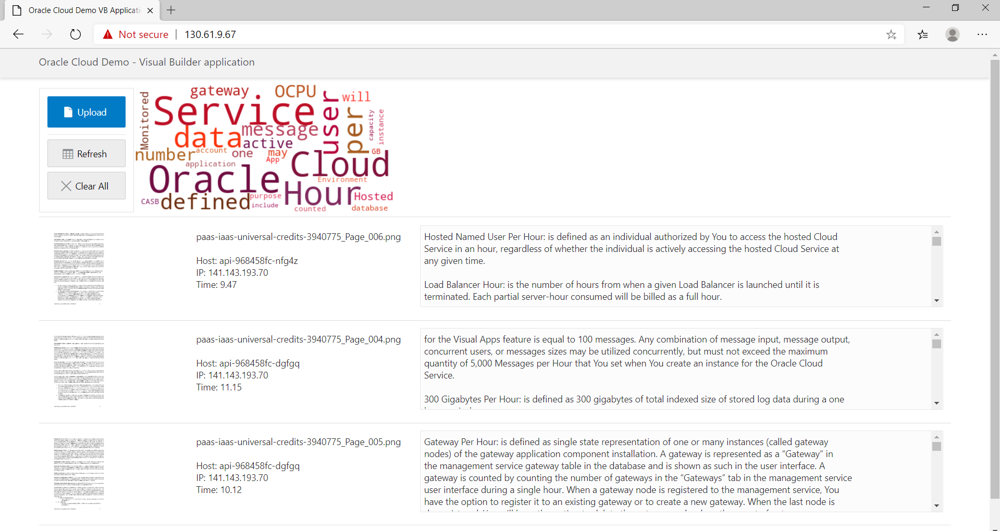{width="5.098958880139983in"
height="2.710252624671916in"}

История развертывания и откат к предыдущей версии
-------------------------------------------------

Можно вновь изменить образ, выполнив команду:

andrey\_nep\@cloudshell:clouddemo-micro (eu-frankfurt-1)\$ **kubectl set
image deployment/wc
wc=fra.ocir.io/\$NAMESPACE/clouddemo-micro/wc:1.0-green \--record**

deployment.extensions/wc image updated

Теперь можно посмотреть историю развертывания образов. Выполните
команду:

andrey\_nep\@cloudshell:clouddemo-micro (eu-frankfurt-1)\$ **kubectl
rollout history deployment wc**

deployment.extensions/wc

REVISION CHANGE-CAUSE

1 \<none\>

2 kubectl set image deployment/wc
wc=fra.ocir.io/frxhexdipnsp/clouddemo-micro/wc:1.0-red \--record=true

3 kubectl set image deployment/wc
wc=fra.ocir.io/frxhexdipnsp/clouddemo-micro/wc:1.0-green \--record=true

В результате выполнения команды показаны 3 ревизии в истории
развертывания: первоначальная (1), которая имела метку latest, (2)
1.0-red и (3) 1.0-green.

Можно вернуться к предыдущей версии образа, выполнив команду:

andrey\_nep\@cloudshell:clouddemo-micro (eu-frankfurt-1)\$ **kubectl
rollout undo deployment wc**

deployment.extensions/wc

В результате будет создана новая ревизия развертывания, в которой будет
отменено последнее изменение.

Можно вернуться к любой ревизии в сохраненной истории:

andrey\_nep\@cloudshell:clouddemo-micro (eu-frankfurt-1)\$ **kubectl
rollout history deployment wc**

andrey\_nep\@cloudshell:clouddemo-micro (eu-frankfurt-1)\$ **kubectl
rollout undo deployment wc \--to-revision=1**

deployment.extensions/wc

Масштабирование кластера
------------------------

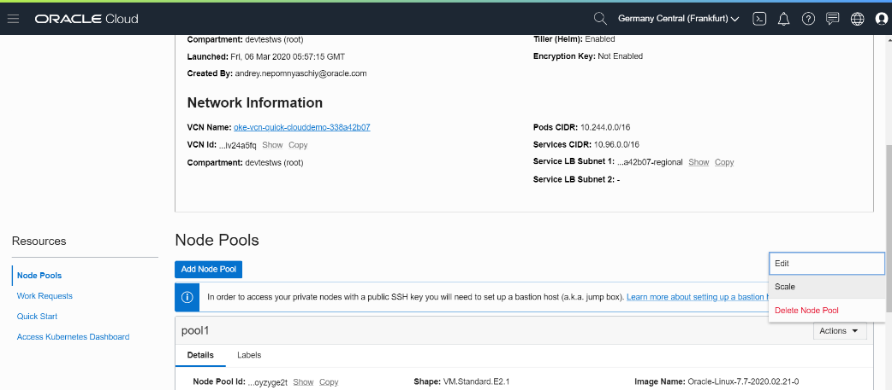{width="4.736111111111111in"
height="2.0770833333333334in"}На странице информации о кластере
пролистайте ниже до раздела **Node Pools** и нажмите **Actions /
Scale**.

В открывшемся окне укажите требуемое количество рабочих узлов (например,
4), пролистайте вниз и нажмите **Scale**.

Будут созданы (или удалены) узлы, чтобы общее их количество равнялось
требуемому.

Если установить размер Node Pool в 0, то рабочие узлы этого пула будут
удалены, нагрузка с них убрана (а в отсутствии других пулов все pod
будут поставлены в режим Pending), однако кластер удален не будет.

Также можно масштабировать кластер командой oci cli:

andrey\_nep\@cloudshell:clouddemo-micro (eu-frankfurt-1)\$ **oci ce
node-pool update \--node-pool-id \<Paste your Node Pool OCID Here\>
\--size 0**

Вставьте OCID вашего Node Pool. Замените значение size на нужный размер
пула.

Завершение и очистка
--------------------

Далее приведены основные сервисы и ресурсы, которые были созданы во
время практикума и которые рекомендуется удалить или остановить, если
они больше не нужны, чтобы не происходило списание средств за их работу.

Удалите pod и сервисы, включая балансировщик нагрузки.

\[opc\@docker clouddemo-micro\]\$ **kubectl delete -f
kube/clouddemo-micro.yaml**

\[opc\@docker clouddemo-micro\]\$ **kubectl delete -f
kube/clouddemo-micro-lb.yaml**

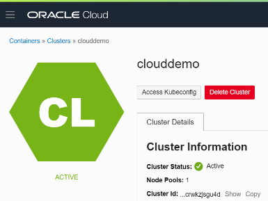{width="1.75in"
height="1.3113068678915136in"}Удалите кластер Kubernetes, нажав **Delete
Cluster**. Вместе с кластером автоматически удалятся и рабочие узлы.
Если удалить кластер, не удалив предварительно сервисы, то созданный
балансировщик нагрузки автоматически не удаляется.

Если вы хотите остановить кластер, но не удалять
его,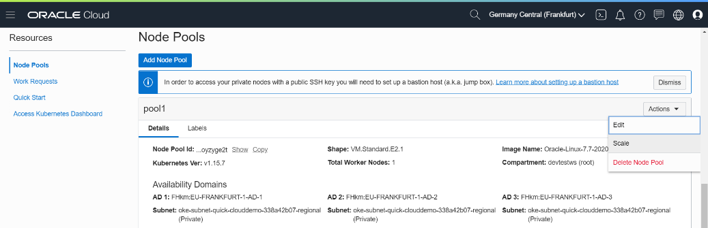{width="4.717592957130359in"
height="1.5217465004374453in"} пролистайте ниже до раздела Node Pools и
нажмите **Actions / Scale**.

{width="2.4105205599300086in"
height="0.5046292650918636in"}В появившемся окне установите в поле
Number of Nodes значение, равное 0. Пролистайте ниже и нажмите Scale.

В результате рабочие узлы будут удалены, но кластер останется активным.
Все Pod будут переведены в состояние Pending.

Если кластер понадобится снова, то увеличьте количество узлов до
требуемого. Как только новые узлы будут созданы, кластер заработает и
pod будут запущены на новых узлах.

{width="4.726851487314086in"
height="1.701774934383202in"}Удалите виртуальную машину, нажав в меню
Actions детальной информации о виртуальной машине **Terminate**.

Вы можете удалить загрузочный диск виртуальной машины вместе с ней или
оставить его для дальнейшего использования.

Или остановите виртуальную машину, нажав **Stop**.

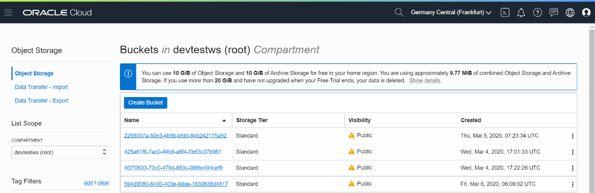{width="4.736111111111111in"
height="1.5381277340332458in"}Удалите содержимое хранилища Object
Storage, созданное программой.

«Вёдра» можно удалять только после удаления содержимого.

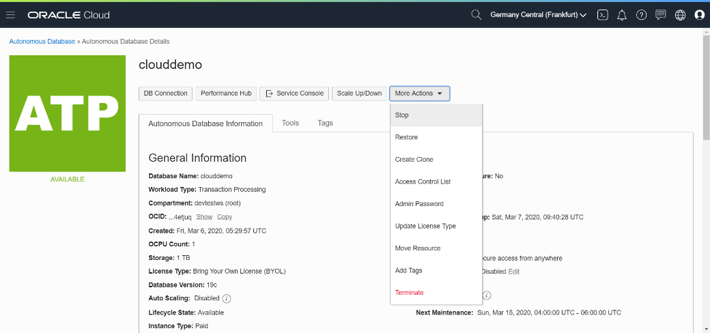{width="4.726388888888889in"
height="2.2164260717410325in"}Удалите автономную базу данных, нажав
**Terminate** в окне детальной информации о базе данных.

Или остановите базу данных, нажав **Stop**.

При этом приложение в кластере перестанет работать. Если оно снова
потребуется, перед началом работы с приложением запустите базу данных.
